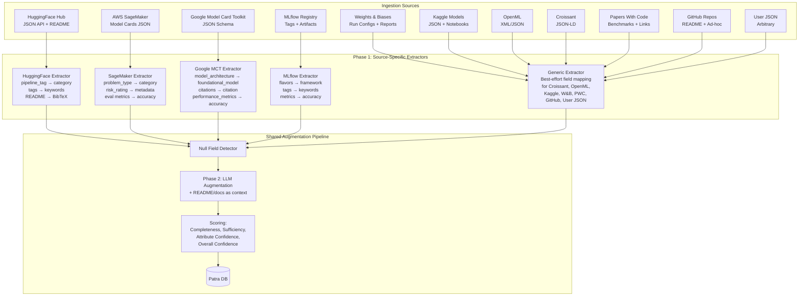
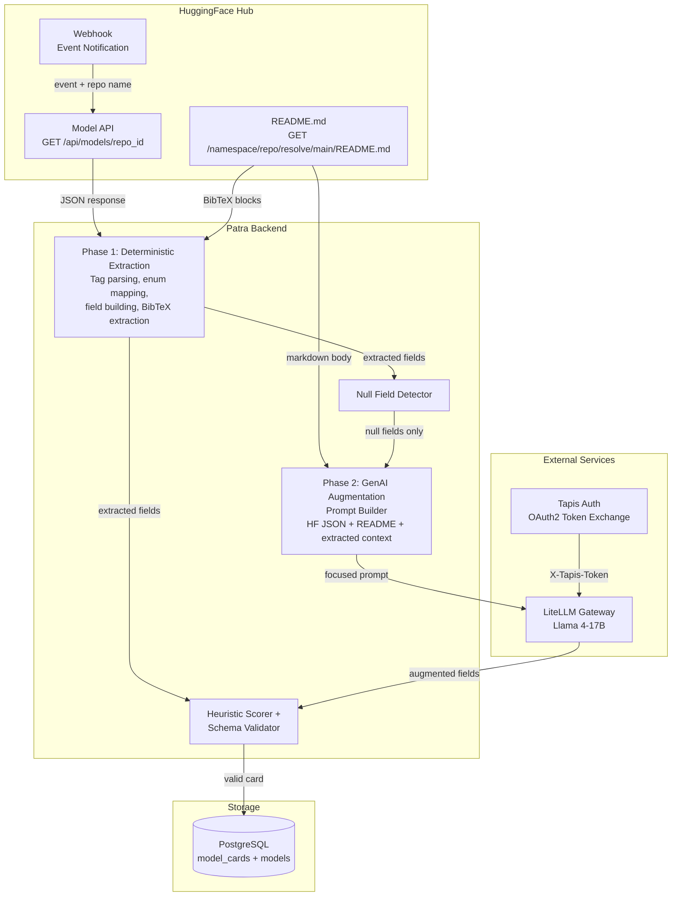
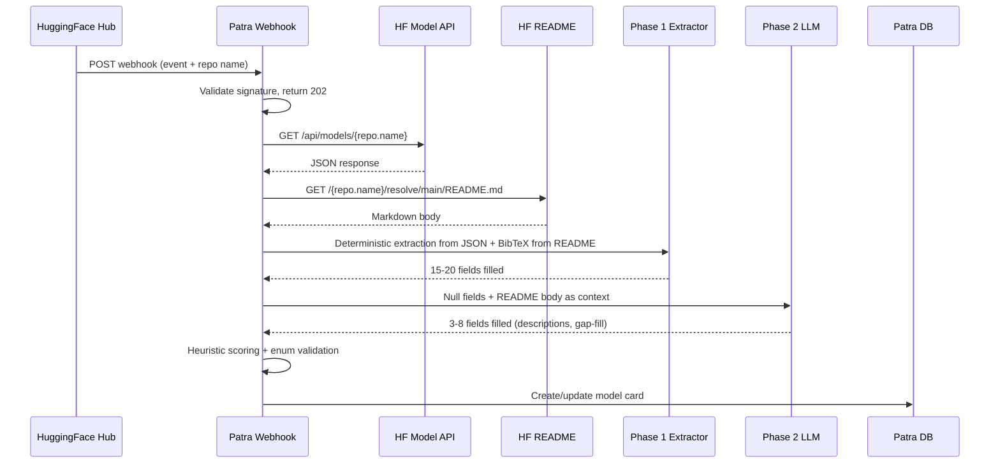

# Data Augmentation for ML Record Discoverability

## 1. Problem Statement

ML model cards and datasheets are ingested into Patra from heterogeneous sources. Each platform uses a different metadata schema, and none map directly to Patra's catalogue schema.

### Source Platforms

| Platform | Type | Metadata Format | API Access | Typical Sparsity |
|----------|------|----------------|------------|-----------------|
| **HuggingFace Hub** | Open registry | YAML frontmatter + JSON API + README | REST API + webhooks | Medium — structured fields present, descriptions in README |
| **AWS SageMaker Model Registry** | Enterprise MLOps | JSON Schema Draft 7 (Model Cards) | AWS SDK / Boto3 | Low — enterprise-mandated fields, but vendor-specific schema |
| **Google Model Card Toolkit** | Open standard | JSON Schema (model_details, model_parameters, considerations) | Python API | Medium — structured but often auto-generated stubs |
| **MLflow Model Registry** | Open-source MLOps | Key-value tags + artifact metadata + MLmodel YAML | REST API + Python | High — minimal required metadata, most fields user-defined |
| **Weights & Biases** | Experiment tracking | Run configs + artifact metadata + report links | REST API + Python | Medium — rich experiment data, sparse model documentation |
| **Kaggle Models** | Competition platform | JSON metadata + notebook-based documentation | REST API | Medium — structured fields for competition models, sparse for community |
| **OpenML** | Research platform | XML/JSON (task, flow, run, dataset descriptions) | REST API | Low-Medium — research-focused, structured but different schema |
| **MLCommons Croissant** | Metadata standard | JSON-LD (schema.org/Dataset + ML extensions) | File-based | Varies — standard defines fields but adoption is early |
| **Papers With Code** | Research index | Task → dataset → model linking, benchmark tables | REST API | Low for benchmarked models, absent for others |
| **PyTorch Hub / TensorFlow Hub** | Framework hubs | Minimal: model name + task + framework version | Python API | High — focus on code loading, minimal metadata |
| **ONNX Model Zoo** | Interoperability | ONNX model metadata + README per model | GitHub-based | High — optimized for inference, sparse documentation |
| **GitHub Repositories** | General hosting | README.md + ad-hoc model cards | GitHub API | Very high — no standard, depends on author effort |
| **User-submitted JSON** | Manual ingestion | Arbitrary structure | Direct upload | Very high — no schema enforcement |

### Schema Comparison: What Each Source Provides

| Patra Field | HuggingFace | SageMaker | Google MCT | MLflow | Croissant | Papers With Code |
|-------------|-------------|-----------|------------|--------|-----------|-----------------|
| `name` | `id` | model description | `model_details.name` | model name | `name` | model name |
| `category` | `pipeline_tag` | problem type | — | — | — | task.name |
| `input_type` | `pipeline_tag` (inferred) | — | `model_parameters.input_format` | — | — | — |
| `keywords` | `tags[]` | custom details | — | tags | keywords (schema.org) | — |
| `author` | `author` | creator/owner | `model_details.owners[]` | — | `creator` | — |
| `short_description` | — (README) | model description | `model_details.overview` | — | `description` | — |
| `full_description` | — (README) | — | `model_details.documentation` | — | `description` | — |
| `citation` | — (README BibTeX) | — | `model_details.citations[]` | — | `citation` (schema.org) | paper BibTeX |
| `foundational_model` | `cardData.base_model` | — | `model_parameters.model_architecture` | — | — | — |
| `framework` | `library_name` | container image | — | flavors (sklearn, pytorch, etc.) | — | — |
| `license` | `cardData.license` | — | `model_details.licenses[]` | — | `license` | — |
| `test_accuracy` | `model-index` (rare) | evaluation metrics | `quantitative_analysis.performance_metrics[]` | logged metrics | — | SOTA benchmark |
| `input_data` | `cardData.datasets[]` | training datasets | `model_parameters.data[]` | — | `distribution` | dataset link |
| `ethical_considerations` | — (README section) | ethical considerations | `considerations.ethical_considerations[]` | — | — | — |
| `limitations` | — (README section) | caveats and recommendations | `considerations.limitations[]` | — | — | — |

Key: ✓ means the field exists in a structured format. — means absent or unstructured.

### The Cross-Schema Problem

No two sources use the same schema. A model registered in SageMaker has `problem_type` and `risk_rating` but no `pipeline_tag`. A HuggingFace card has `pipeline_tag` and `tags` but no `risk_rating`. MLflow has experiment metrics but no model card structure at all. Papers With Code has benchmark tables but no model metadata beyond task linking.

The augmentation pipeline must handle all of these. The core architecture (Phase 1 deterministic extraction → Phase 2 LLM augmentation) is source-agnostic, but each source needs its own Phase 1 extraction layer.

### Generalized Architecture



### Research Questions

- **RQ1 (Feasibility)**: Can a pipeline combining deterministic extraction and LLM augmentation transform heterogeneous ML metadata into Patra's schema reliably?
- **RQ2 (Phase Contribution)**: How much does each phase contribute to field coverage and accuracy?
- **RQ3 (Schema Compliance)**: Can augmented values be constrained to match Patra's enum-based schema without sacrificing quality?
- **RQ4 (Citation Safety)**: Can citations be extracted without LLM hallucination risk?
- **RQ5 (README Impact)**: Does providing source documentation to the LLM improve description quality compared to deterministic extraction or LLM-only generation?

## 2. Related Work

### Foundational Standards
- **Model Cards** (Mitchell et al., 2019, FAccT): Defines what to document for ML models, but not how to fill fields automatically. Implemented by HuggingFace, Google MCT, and AWS SageMaker in different formats.
- **Datasheets for Datasets** (Gebru et al., 2021, CACM): A template for dataset documentation, requiring manual entry.
- **FAIR Principles** (Wilkinson et al., 2016, Scientific Data): Our discoverability scoring directly measures the "F" (Findable) dimension.
- **Croissant** (MLCommons, 2024): JSON-LD metadata format for ML datasets, building on schema.org/Dataset. Adopted by HuggingFace, Kaggle, and OpenML. Defines schema but doesn't auto-populate it.

### Platform-Specific Model Card Implementations
- **AWS SageMaker Model Cards**: JSON Schema Draft 7 format with structured sections for model overview, intended uses, business details, training/evaluation details, and ethical considerations. Closest to a complete governance schema but vendor-locked.
- **Google Model Card Toolkit** (TensorFlow, github.com/tensorflow/model-card-toolkit): Open-source JSON schema with `model_details`, `model_parameters`, `quantitative_analysis`, and `considerations` sections. Proto-based intermediate format. Captures citations and ethical considerations structurally.
- **MLflow Model Registry**: Minimal metadata (name, version, stage, tags). Rich experiment tracking (metrics, parameters, artifacts) but no model card structure. Metadata must be inferred from logged experiment data.
- **Papers With Code**: Links tasks → datasets → models → papers with SOTA benchmark tables. Strong structured data for benchmarked models, but no metadata for models without papers.

### LLM-Based Data Augmentation
- **LLM-data-aug-survey** (Zhou et al., 2024, arXiv:2401.15422): Augments training samples, not catalog metadata.
- **ServiceNow data-augmentation-with-llms** (Sahu et al., ACL 2022): Intent classification augmentation, not structured metadata.

### The Gap
No prior work addresses LLM-based metadata augmentation across multiple ML registry schemas. Each platform has its own model card format, and the cross-schema transformation problem — mapping SageMaker's `problem_type` to Patra's `category` while simultaneously mapping HuggingFace's `pipeline_tag` to the same field — has not been studied. Existing tools either define schemas without filling them, augment training data rather than catalogue metadata, or enrich records only when the source already exists in an external database.

## 3. System Architecture



### Ingestion Flow



Webhook returns 202 Accepted immediately. Augmentation runs in a background worker.

### Design Principles

1. **Deterministic first.** Extract every field possible from structured data before calling the LLM. This maximizes accuracy and minimizes cost.
2. **Schema-constrained.** All values must conform to Patra's enum fields (`category`, `ai_model.framework`, `ai_model.model_type`). The LLM prompt includes allowed values.
3. **Never fabricate citations.** Citations are extracted from arXiv tags or BibTeX blocks in the README. If neither source is available, the field is null. A fabricated citation in a research catalog is worse than an empty one.
4. **README as LLM context.** The README body is passed to the LLM prompt as reference material for generating descriptions. BibTeX citation blocks are extracted deterministically in Phase 1.

## 4. HuggingFace Data Sources

### 4.1 Model API Response

The primary input is the JSON returned by `GET /api/models/{namespace}/{repo}`.

#### HuggingFace Model API Fields

| Field | Type | Description |
|---|---|---|
| `_id` | string | Internal HuggingFace database ID |
| `id` | string | Repository ID (e.g. `microsoft/resnet-50`) |
| `modelId` | string | Same as `id` |
| `author` | string | Organization or user who owns the repo |
| `private` | boolean | Whether the repo is private |
| `gated` | boolean or string | Access control (`false`, `true`, or `"auto"`) |
| `disabled` | boolean | Whether the repo is disabled |
| `pipeline_tag` | string | ML task type (e.g. `image-classification`, `text-generation`) |
| `library_name` | string | ML framework or library (e.g. `transformers`, `ultralytics`) |
| `tags` | array of strings | Metadata tags, including prefixed tags (`dataset:`, `arxiv:`, `license:`, `region:`) |
| `downloads` | integer | Total download count |
| `likes` | integer | Community likes |
| `lastModified` | string (ISO 8601) | Last modification timestamp |
| `createdAt` | string (ISO 8601) | Creation timestamp |
| `model-index` | object or null | Benchmark results and evaluation metrics (usually null) |
| `config` | object | Model configuration from `config.json` |
| `config.architectures` | array of strings | Model class names (e.g. `["ResNetForImageClassification"]`) |
| `config.model_type` | string | Architecture family (e.g. `resnet`, `bert`, `llama`) |
| `cardData` | object | Parsed YAML frontmatter from README.md |
| `cardData.license` | string | License identifier |
| `cardData.tags` | array of strings | Topic tags from frontmatter |
| `cardData.datasets` | array of strings | Training dataset names |
| `cardData.base_model` | string | Base model repo ID (for fine-tuned models) |
| `transformersInfo` | object | Transformers library metadata (only for transformers models) |
| `siblings` | array of objects | List of files in the repo (`{rfilename: "README.md"}`) |
| `spaces` | array of strings | Related HuggingFace Spaces |
| `usedStorage` | integer | Storage used in bytes |

#### Example Response

```json
{
  "_id": "62320573f8e97eef2a7ea544",
  "id": "microsoft/resnet-50",
  "author": "microsoft",
  "private": false,
  "gated": false,
  "pipeline_tag": "image-classification",
  "library_name": "transformers",
  "tags": [
    "transformers", "pytorch", "safetensors", "resnet", "image-classification",
    "vision", "dataset:imagenet-1k", "arxiv:1512.03385", "license:apache-2.0", "region:us"
  ],
  "downloads": 313630,
  "likes": 492,
  "config": {
    "architectures": ["ResNetForImageClassification"],
    "model_type": "resnet"
  },
  "cardData": {
    "license": "apache-2.0",
    "tags": ["vision", "image-classification"],
    "datasets": ["imagenet-1k"]
  },
  "siblings": [
    {"rfilename": "README.md"},
    {"rfilename": "config.json"},
    {"rfilename": "model.safetensors"}
  ]
}
```

#### Observations from Real ICICLE-AI Cards

- Metadata sparsity varies widely. Popular models (ResNet-50) have rich metadata. Research models (ICICLE GNN) may lack `library_name`, `config`, and `cardData.datasets`.
- The `gated` field can be boolean or string (`"auto"`).
- The fields `description`, `citation`, and `base_model` are not in the API response. They live in the README.md.
- Prefixed tags encode structured data: `dataset:imagenet-1k`, `arxiv:1512.03385`, `license:apache-2.0`.

### 4.2 HuggingFace Dataset API Response

The dataset API (`GET /api/datasets/{namespace}/{repo}`) returns a similar structure for datasets. The fields below are based on HuggingFace documentation; the POC has not yet been extended to dataset ingestion.

#### HuggingFace Dataset API Fields

| Field | Type | Description |
|---|---|---|
| `_id` | string | Internal HuggingFace database ID |
| `id` | string | Repository ID (e.g. `ICICLE-AI/CAN_Benchmark`) |
| `author` | string | Organization or user who owns the repo |
| `private` | boolean | Whether the repo is private |
| `gated` | boolean or string | Access control |
| `disabled` | boolean | Whether the repo is disabled |
| `tags` | array of strings | Metadata tags (including `task_categories:`, `language:`, `license:`, `size_categories:`) |
| `downloads` | integer | Total download count |
| `likes` | integer | Community likes |
| `lastModified` | string (ISO 8601) | Last modification timestamp |
| `createdAt` | string (ISO 8601) | Creation timestamp |
| `cardData` | object | Parsed YAML frontmatter from dataset README |
| `cardData.license` | string | License identifier |
| `cardData.task_categories` | array of strings | Task types the dataset supports |
| `cardData.language` | array of strings | Languages in the dataset |
| `cardData.size_categories` | array of strings | Dataset size range (e.g. `1K<n<10K`) |
| `cardData.pretty_name` | string | Human-readable dataset name |
| `cardData.configs` | array of objects | Dataset configuration splits |
| `siblings` | array of objects | List of files in the repo |

### 4.3 README.md

The secondary input is the model's README file, fetched via `GET /{namespace}/{repo}/resolve/main/README.md`. It contains YAML frontmatter (already parsed into `cardData` by the API) plus a markdown body with descriptions, usage examples, training details, and BibTeX citation blocks.

The README body is the only source for `short_description` and `full_description`. It is also a source for `citation` when a BibTeX block is present (arXiv tags in the JSON API are the other citation source).

## 5. Patra Schema

All output conforms to `db/schema.dbml` and `patra-toolkit/schema/schema.json`.

### Model Card Fields

| Field | DB Type | Required | Description |
|---|---|---|---|
| `name` | text | Yes | Display name |
| `version` | text | No | Version string |
| `short_description` | text | No | Brief summary |
| `full_description` | text | No | Comprehensive description |
| `keywords` | text | No | Comma-separated keywords |
| `author` | text | No | Creator or organization |
| `citation` | text | No | Citation info (BibTeX or URL) |
| `input_data` | text | No | Training data reference (URL or DOI) |
| `input_type` | text | No | Input data type (Image, Text, Audio, etc.) |
| `output_data` | text | No | Model output description (URL or DOI) |
| `foundational_model` | text | No | Base model ID if applicable |
| `category` | text | No | ML task category (enum, 27 values) |
| `documentation` | text | No | Link to documentation (URL) |
| `is_private` | boolean | Yes | Visibility flag (default: false) |
| `is_gated` | boolean | Yes | Access control flag (default: false) |
| `status` | approval_status | Yes | `pending`, `approved`, `rejected` (default: pending) |
| `ai_model.name` | text | Yes | Name of the model binary |
| `ai_model.version` | text | No | Model version |
| `ai_model.description` | text | No | Description of the AI model |
| `ai_model.owner` | text | No | Owner or organization |
| `ai_model.location` | text | No | Download URL |
| `ai_model.license` | text | No | License identifier |
| `ai_model.framework` | text | No | ML framework (enum: `sklearn`, `tensorflow`, `pytorch`, `other`) |
| `ai_model.model_type` | text | No | Architecture type (enum: `cnn`, `decision_tree`, `dnn`, `rnn`, `svm`, `kmeans`, `llm`, `random_forest`, `lstm`, `gnn`, `other`) |
| `ai_model.test_accuracy` | numeric(6,5) | No | Test accuracy (0 to 1) |
| `ai_model.model_metrics` | jsonb | No | Additional performance metrics |
| `ai_model.inference_labels` | jsonb | No | Inference labels |
| `ai_model.model_structure` | jsonb | No | Architecture structure details |

### category Enum (27 values)

`classification`, `regression`, `clustering`, `anomaly detection`, `dimensionality reduction`, `reinforcement learning`, `natural language processing`, `computer vision`, `recommendation systems`, `time series forecasting`, `graph learning`, `graph neural networks`, `generative modeling`, `transfer learning`, `self-supervised learning`, `semi-supervised learning`, `unsupervised learning`, `causal inference`, `multi-task learning`, `metric learning`, `density estimation`, `multi-label classification`, `ranking`, `structured prediction`, `neural architecture search`, `sequence modeling`, `embedding learning`, `other`

### Datasheet Fields

Patra datasheets follow the DataCite v4.4 metadata schema for dataset documentation.

| Field | DB Type | Required | Description |
|---|---|---|---|
| `publication_year` | integer | No | Year of publication |
| `resource_type` | text | No | Specific resource type |
| `resource_type_general` | text | No | DataCite general type (Dataset, Software, Text, etc.) |
| `size` | text | No | Dataset size |
| `format` | text | No | Data format (CSV, JSON, Parquet, etc.) |
| `version` | text | No | Dataset version |
| `is_private` | boolean | Yes | Default: false |
| `status` | approval_status | Yes | `pending`, `approved`, `rejected` |

## 6. Phase 1: Deterministic Extraction

Fields extracted directly from the HF API JSON with no LLM call:

| Patra Field | HF API Source | Transformation |
|---|---|---|
| `name` | `id` | Strip org prefix: `microsoft/resnet-50` to `resnet-50` |
| `version` | `cardData.version` | Default `"1.0"` if absent |
| `keywords` | `cardData.tags` or filtered top-level `tags` | Join with commas, exclude prefixed tags |
| `author` | `author` | Direct copy |
| `citation` | `arxiv:` tags or README BibTeX block | arXiv URL or extracted BibTeX; null if neither found. Never LLM-generated. |
| `input_data` | `cardData.datasets` or `dataset:` tags | Build HF URL: `https://huggingface.co/datasets/{name}` |
| `input_type` | `pipeline_tag` | Lookup table (Image, Text, Audio, Tabular, Multimodal, Video) |
| `output_data` | `pipeline_tag` | Lookup table ("class label", "generated text", etc.) |
| `foundational_model` | `cardData.base_model` | Strip org prefix |
| `category` | `pipeline_tag` | Lookup table to schema enum values |
| `documentation` | `id` | `https://huggingface.co/{id}` |
| `is_private` | `private` | Direct copy |
| `is_gated` | `gated` | Coerce to boolean (`"auto"` becomes `true`) |
| `ai_model.framework` | `library_name` | Map to engine: `transformers` to `pytorch`, `sklearn` to `sklearn` |
| `ai_model.license` | `cardData.license` or `license:` tag | Direct copy |
| `ai_model.model_type` | `config.model_type` or `config.architectures[0]` | Map to enum: `resnet` to `cnn`, `bert` to `dnn`, `llama` to `llm` |
| `ai_model.version` | Same as card version | Default `"1.0"` |
| `ai_model.owner` | `author` | Direct copy |
| `ai_model.location` | `id` | `https://huggingface.co/{id}` |
| `ai_model.test_accuracy` | `model-index` metrics | Parse if present, null otherwise |

## 7. Phase 2: GenAI Augmentation

The LLM is called only for fields that are still null after Phase 1. The README body is included in the prompt as reference material for description generation.

### Fields Eligible for LLM Generation

| Field | When LLM is needed |
|---|---|
| `short_description` | Always (not in HF API JSON) |
| `full_description` | Always (not in HF API JSON) |
| `ai_model.description` | Always (not in HF API JSON) |
| `keywords` | When `cardData.tags` is empty |
| `input_type` | When no `pipeline_tag` exists |
| `output_data` | When no `pipeline_tag` exists |
| `category` | When no `pipeline_tag` exists |
| `foundational_model` | When no `cardData.base_model` exists |
| `ai_model.framework` | When no `library_name` exists |
| `ai_model.model_type` | When no `config` exists |

### Fields Never Sent to LLM

| Field | Reason |
|---|---|
| `citation` | Fabricated BibTeX is harmful in a research catalog |
| `ai_model.test_accuracy` | Cannot be inferred from metadata |

### Prompt Design

The prompt receives four inputs: (1) the full HF API JSON, (2) the README body (truncated to 3000 chars), (3) fields already extracted so the LLM does not regenerate them, and (4) only the remaining null fields with their schema descriptions.

```
You are a metadata specialist for the Patra ML model catalog.

Given this HuggingFace model API response and README content,
fill in ONLY the missing fields listed below.
Do NOT regenerate fields that are already extracted.

## HuggingFace API response
{hf_json}

## README.md content
{readme_body}

## Fields already extracted (for context, do NOT change these)
{extracted_json}

## Fields to fill (these are null, generate values for them)
{missing_fields_json}

## Schema constraints
- "category" must be one of: classification, regression, ... (27 enum values)
- "ai_model_framework" must be one of: sklearn, tensorflow, pytorch, other
- "ai_model_model_type" must be one of: cnn, dnn, llm, gnn, ... (11 enum values)

## Rules
- Use information from both the HF API response and the README content
- For "short_description", write one concise sentence. Do not copy the full_description.
- For "full_description", write 2-4 sentences. Do not duplicate the short_description verbatim.
- If you cannot infer a value, set it to null with confidence 0.0
- "keywords" should be comma-separated, not a JSON array
- "foundational_model" should be the architecture name only, not the full repo path
```

### Error Handling

If the LLM returns an empty or unparseable response, the pipeline continues with Phase 1 results only. The failure is logged as a warning, not an error.

## 8. Evaluation Metrics

Four metrics evaluate augmentation quality. Computed per-record and aggregated across the test set.

### 8.1 Completeness

Fraction of all augmentable Patra fields with a non-null value after augmentation.

```
Completeness = |filled fields| / |total augmentable fields|
```

Total augmentable fields for model cards: 24 (excludes system fields: id, status, timestamps, versioning). Upper bound < 1.0 because some fields cannot be determined from available context (e.g., `ai_model.test_accuracy` requires running the model).

### 8.2 Sufficiency

Fraction of **required** fields filled. Required = minimum set for a record to be findable in the catalog.

```
Sufficiency = |filled required fields| / |total required fields|
```

Required fields for model cards (6):

| Field | Why required |
|-------|-------------|
| `name` | Record identity |
| `category` | Primary filter dimension |
| `input_type` | Secondary filter |
| `keywords` | Full-text search discoverability |
| `author` | Attribution and author search |
| `short_description` | Search snippet and browse display |

A record with Sufficiency < 0.8 is partially broken for search.

### 8.3 Attribute Confidence

Per-field score in [0, 1] reflecting likelihood the augmented value is correct. Three components:

```
Attribute Confidence(field) = w_h × heuristic_score + w_s × source_score + w_l × llm_confidence
```

**Heuristic score** (0 to 1): Format/domain validation.

| Field | Score 1.0 | Score 0.3 |
|---|---|---|
| `category` | Value in schema enum (27 values) | Not in enum |
| `ai_model.framework` | Value in `{sklearn, tensorflow, pytorch, other}` | Not in enum |
| `ai_model.model_type` | Value in schema enum (11 values) | Not in enum |
| `input_data` | Starts with `http` | Bare dataset name |
| `keywords` | 2+ comma-separated terms, each under 40 chars | Fewer terms or too long |
| `short_description` | 20 to 200 chars | Outside range |
| `full_description` | Over 50 chars | Under 30 chars |
| `citation` | Contains `@` (BibTeX) or `http` (URL) | Neither |

**Source score** (0 to 1): Reliability of the data source.

| Source | Score | Rationale |
|--------|-------|-----------|
| HuggingFace API field (direct mapping) | 1.0 | Authoritative, deterministic |
| README BibTeX extraction (regex) | 0.95 | Author-provided, structured |
| Semantic Scholar / arXiv paper | 0.9 | Authoritative academic source |
| README content summarized by LLM | 0.8 | Real document, LLM may misinterpret |
| LLM with retrieved context | 0.7 | Grounded but still generated |
| LLM zero-shot (no retrieval) | 0.5 | Training knowledge only, may hallucinate |
| Not filled | 0.0 | Field left empty |

**LLM confidence** (0 to 1): For deterministic fields, always 1.0. For LLM fields, the model's self-reported certainty.

**Composite** (backward-compatible shorthand for Attribute Confidence with default weights):

```
composite = 0.4 × llm_confidence + 0.6 × heuristic_score
```

### 8.4 Overall Confidence

Mean of all Attribute Confidence scores across a record.

```
Overall Confidence = (1/N) × Σ Attribute Confidence(field_i)
```

N = number of augmentable fields (24). Empty fields contribute 0.0. This creates a tension: filling more fields with low-confidence guesses can lower Overall Confidence.

### 8.5 Per-Field Accuracy (ground truth comparison)

**Semantic overlap** (0 to 1): Token-level set intersection between augmented value and ground truth:

```
overlap = |tokens_aug ∩ tokens_gt| / max(|tokens_aug|, |tokens_gt|)
```

## 9. Experiment Results

### 9.1 Setup

- 20 synthetic HF-API-shaped model cards across 6 domains (CV, NLP, Audio, Tabular, Multimodal, Scientific)
- 4 real ICICLE-AI cards as format reference (not included in scoring)
- LLM: Llama 4-17B via LiteLLM on Tapis
- Synthetic README bodies: 7 rich (with BibTeX), 3 medium (description only), 7 sparse (one paragraph), 3 empty
- Each card scored against hand-written ground truth conforming to Patra schema enums

### 9.2 Approaches Tested

Three configurations tested, representing a progression from no README context to full README integration:

| Approach | Phase 1 | Phase 2 (LLM) | README usage |
|---|---|---|---|
| **A: No README** | JSON + arXiv/BibTeX extraction | LLM without README context | None |
| **B1: Deterministic README** | JSON + arXiv/BibTeX extraction + README description parsing | LLM for remaining nulls only | Parsed deterministically |
| **B2: README in Prompt** | JSON + arXiv/BibTeX extraction | LLM with README body as prompt context | Passed to LLM |

Approaches B1 and B2 are variants of the same retrieval-augmented strategy (both fetch the README) but differ in how the README is used: B1 extracts fields deterministically, B2 passes it to the LLM as context.

### 9.3 Results (B2: README in Prompt, 30 records)

Test set: 20 model cards + 10 datasheets. LLM: Llama 4-17B. Avg latency: 1457ms per record.

#### Aggregate Metrics

| Metric | Model Cards (20) | Datasheets (10) | All (30) |
|---|---|---|---|
| **Completeness** | 0.894 | 0.700 | 0.829 |
| **Sufficiency** | 1.000 | 0.840 | 0.947 |
| **Overall Confidence** | 0.849 | 0.684 | 0.794 |

Model cards achieve perfect sufficiency (all 6 required fields filled) with 89% completeness. Datasheets are weaker across all metrics — more fields need LLM inference with less source context available.

#### Per-Field: Model Cards

| Field | Source | AttrConf | Exact% | Overlap | Cover% |
|---|---|---|---|---|---|
| `name` | deterministic | 0.97 | 100% | 1.00 | 100% |
| `version` | deterministic | 0.97 | 0% | 0.00 | 100% |
| `short_description` | mixed | 0.82 | 15% | 0.63 | 100% |
| `full_description` | mixed | 0.81 | 0% | 0.43 | 100% |
| `keywords` | mixed | 0.98 | 85% | 0.91 | 100% |
| `author` | deterministic | 0.97 | 100% | 1.00 | 100% |
| `citation` | mixed | 0.43 | 65% | 0.00 | 35% |
| `input_data` | mixed | 0.54 | 90% | 0.35 | 45% |
| `input_type` | mixed | 0.95 | 100% | 1.00 | 100% |
| `output_data` | mixed | 0.91 | 0% | 0.00 | 100% |
| `foundational_model` | mixed | 0.65 | 30% | 0.05 | 75% |
| `category` | mixed | 0.95 | 90% | 0.90 | 100% |
| `documentation` | deterministic | 0.97 | 0% | 0.00 | 100% |
| `is_private` | deterministic | 0.97 | 0% | 0.00 | 100% |
| `is_gated` | deterministic | 0.97 | 0% | 0.00 | 100% |
| `ai_model.framework` | mixed | 0.92 | 60% | 0.60 | 100% |
| `ai_model.license` | deterministic | 0.97 | 100% | 1.00 | 100% |
| `ai_model.model_type` | mixed | 0.88 | 55% | 0.55 | 100% |
| `ai_model.version` | deterministic | 0.97 | 0% | 0.00 | 100% |
| `ai_model.description` | mixed | 0.81 | 0% | 0.00 | 100% |
| `ai_model.owner` | deterministic | 0.97 | 0% | 0.00 | 100% |
| `ai_model.location` | deterministic | 0.97 | 0% | 0.00 | 100% |
| `ai_model.test_accuracy` | mixed | 0.23 | 100% | 0.00 | 0% |

#### Per-Field: Datasheets

| Field | Source | AttrConf | Exact% | Overlap | Cover% |
|---|---|---|---|---|---|
| `title` | deterministic | 0.97 | 100% | 1.00 | 100% |
| `description` | mixed | 0.55 | 0% | 0.19 | 60% |
| `subjects` | mixed | 0.80 | 0% | 0.26 | 100% |
| `creator` | deterministic | 0.97 | 100% | 1.00 | 100% |
| `publisher` | mixed | 0.54 | 0% | 0.29 | 60% |
| `resource_type` | mixed | 0.54 | 20% | 0.39 | 60% |
| `resource_type_general` | mixed | 0.58 | 60% | 0.60 | 60% |
| `publication_year` | deterministic | 1.00 | 90% | 0.90 | 100% |
| `size` | mixed | 0.59 | 0% | 0.00 | 50% |
| `format` | mixed | 0.51 | 30% | 0.34 | 50% |
| `version` | mixed | 0.20 | 0% | 0.00 | 0% |
| `license` | deterministic | 0.97 | 100% | 1.00 | 100% |

#### Per-Domain

| Domain | N | Completeness | Sufficiency | Overall Confidence |
|---|---|---|---|---|
| CV | 6 | 0.860 | 0.933 | 0.829 |
| NLP | 6 | 0.894 | 1.000 | 0.846 |
| Audio | 5 | 0.705 | 0.840 | 0.716 |
| Tabular | 5 | 0.788 | 0.920 | 0.749 |
| Multimodal | 3 | 0.870 | 1.000 | 0.848 |
| Scientific | 5 | 0.855 | 1.000 | 0.783 |

### 9.4 Three-Way Approach Comparison

All three approaches share the same Phase 1 deterministic extraction from HF API JSON. They differ in README handling:

- **A (No README)**: LLM generates from HF JSON only. No README context at all.
- **B1 (Deterministic README)**: README parsed deterministically (paragraphs → descriptions, BibTeX → citation). LLM fills remaining nulls without README in prompt.
- **B2 (README in Prompt)**: README passed to LLM as prompt context. BibTeX extracted deterministically. LLM writes descriptions from README.

#### Aggregate Comparison

| Metric | A: No README | B1: Deterministic | B2: README in Prompt |
|---|---|---|---|
| **MC Completeness** | 0.874 | 0.889 | 0.894 |
| **MC Sufficiency** | 1.000 | 1.000 | 1.000 |
| **MC Overall Confidence** | 0.828 | 0.870 | 0.849 |
| **DS Completeness** | 0.633 | 0.675 | 0.700 |
| **DS Sufficiency** | 0.760 | 0.800 | 0.840 |
| **DS Overall Confidence** | 0.625 | 0.660 | 0.684 |

#### Per-Field Comparison: Key Fields (Attribute Confidence)

| Field | A | B1 | B2 | Best | Why |
|---|---|---|---|---|---|
| `MC short_description` | 0.745 | **0.930** | 0.815 | **B1** | Deterministic extraction gets source_score=1.0 vs 0.7 for LLM |
| `MC full_description` | 0.730 | **0.925** | 0.811 | **B1** | Same reason — higher source_score outweighs lower semantic quality |
| `MC ai_model.description` | 0.744 | **0.928** | 0.812 | **B1** | Copied from short_description deterministically |
| `MC foundational_model` | 0.583 | 0.525 | **0.652** | **B2** | LLM with README context infers architecture better |
| `MC citation` | 0.390 | 0.425 | 0.425 | **B1/B2** | Both extract BibTeX from README; A misses it |
| `DS description` | 0.397 | 0.605 | 0.492 | **B1** | Deterministic paragraph extraction scores higher |
| `DS format` | 0.352 | 0.388 | **0.453** | **B2** | LLM infers format from README context |
| `DS resource_type_general` | 0.428 | 0.520 | 0.520 | **B1/B2** | Both equally good with README |

#### Per-Field Comparison: Semantic Overlap (accuracy vs ground truth)

| Field | A | B1 | B2 | Best | Why |
|---|---|---|---|---|---|
| `MC short_description` | 0.49 | 0.47 | **0.62** | **B2** | LLM writes better summaries than paragraph extraction |
| `MC full_description` | 0.29 | 0.41 | **0.43** | **B2** | LLM synthesizes README more coherently |
| `MC foundational_model` | 0.06 | 0.05 | 0.05 | (all low) | Hard to match exact architecture names |
| `DS description` | 0.10 | **0.19** | 0.17 | **B1** | Direct paragraph copy overlaps more with ground truth |

#### The B1 vs B2 Tradeoff

B1 (Deterministic README) and B2 (README in Prompt) make opposite tradeoffs:

| Dimension | B1 Deterministic | B2 README in Prompt |
|---|---|---|
| **Attribute Confidence** | **Higher** (0.930 for descriptions) | Lower (0.815 for descriptions) |
| **Semantic Overlap** | Lower (0.47 for short_desc) | **Higher** (0.62 for short_desc) |
| **Why** | source_score=1.0 (deterministic) boosts AttrConf | LLM writes better prose but source_score=0.7 |
| **Description quality** | Raw paragraph copy — may be too long or irrelevant | LLM-crafted summary — concise and targeted |
| **short/full duplication** | Often identical (both from same paragraph) | Distinct (prompt instructs different lengths) |

**B1 wins on confidence, B2 wins on quality.** The Attribute Confidence metric favors B1 because deterministic extraction gets source_score=1.0 regardless of semantic quality. The semantic overlap metric favors B2 because the LLM writes better summaries. This reveals a tension in the scoring framework: source reliability and output quality are different dimensions.

### 9.5 Key Findings

**1. Model cards outperform datasheets across all metrics.** Model cards achieve 0.894 Completeness, 1.000 Sufficiency, and 0.849 Overall Confidence. Datasheets score 0.700, 0.840, and 0.684 respectively. The gap is driven by the HuggingFace Dataset API providing fewer structured fields — `description`, `publisher`, `resource_type`, `size`, and `format` have no direct mapping and depend entirely on LLM inference.

**2. Phase 1 deterministic extraction dominates model card quality.** 10 of 23 model card fields are filled deterministically with 0.97 Attribute Confidence: `name`, `version`, `author`, `documentation`, `is_private`, `is_gated`, `ai_model.license`, `ai_model.version`, `ai_model.owner`, `ai_model.location`. These fields are identical regardless of LLM quality.

**3. `keywords` is the strongest LLM-augmented field.** 0.98 Attribute Confidence with 85% exact match and 91% semantic overlap. The LLM effectively transforms HF `tags` into Patra-compatible comma-separated keywords, and fills gaps from README context.

**4. `category` and `input_type` achieve near-perfect accuracy.** 0.95 Attribute Confidence with 90-100% exact match. The `pipeline_tag` → category/input_type lookup table handles most cases; the LLM fills sparse ICICLE-style cards where `pipeline_tag` is missing.

**5. Citation remains the weakest model card field.** 0.43 Attribute Confidence, 35% coverage. Citation is never LLM-generated (by design — fabricated BibTeX is harmful). Only 7 of 20 model cards have arXiv tags or README BibTeX blocks. This confirms that citation augmentation requires external retrieval (Semantic Scholar, arXiv API) as described in the Approach C design.

**6. Datasheet `description` is the weakest field overall.** 0.55 Attribute Confidence, 60% coverage, 19% semantic overlap. The HF Dataset API provides no structured description field — the LLM must generate descriptions from `task_categories`, `pretty_name`, and tags alone. README context helps when available but only 4 of 10 synthetic datasheets have READMEs.

**7. `publication_year` is the strongest datasheet field.** 1.00 Attribute Confidence, 90% exact match. Deterministically extracted from `createdAt` timestamp.

**8. Datasheet `version` is essentially unfillable.** 0.20 Attribute Confidence, 0% coverage. No HF Dataset API field maps to version, and the LLM cannot infer it. This field should be classified as human-only for datasheets.

**9. Audio and Tabular domains score lowest.** Audio: 0.716 Overall Confidence, 0.840 Sufficiency. Tabular: 0.749 Overall Confidence, 0.920 Sufficiency. Both domains have sparse HF metadata (often missing `pipeline_tag`, `library_name`, `config`) and shorter READMEs, forcing heavier LLM reliance.

**10. Scientific domain improved to 1.000 Sufficiency.** Despite sparse metadata, the LLM fills all required fields for scientific models when README context is available. Overall Confidence remains lower (0.783) due to LLM-generated fields having lower source_score.

### 9.6 Recommended Approach

**B2: README in Prompt** remains the recommended approach despite B1 scoring higher on Attribute Confidence:

- B2 produces the best description **quality** (0.62 semantic overlap vs B1's 0.47 for `short_description`)
- B2 avoids the short/full description duplication problem (B1 often copies the same paragraph to both)
- B2's lower Attribute Confidence (0.815 vs 0.930) reflects the source_score penalty for LLM generation, not actual quality — the LLM-written descriptions are more useful for discoverability
- BibTeX citation extraction remains deterministic in all approaches, preserving citation safety

The B1 vs B2 tradeoff reveals that Attribute Confidence as currently weighted overvalues source reliability relative to output quality. A future refinement could weight semantic overlap into the confidence calculation.

## 10. Output Format

Each augmented card is a valid Patra `AssetModelCardCreate` JSON:

```json
{
  "name": "resnet-50",
  "version": "1.0",
  "short_description": "ResNet-50 pre-trained on ImageNet-1k for image classification.",
  "full_description": "ResNet (Residual Network) is a 50-layer convolutional neural network that uses residual learning and skip connections. Pre-trained on ImageNet-1k at 224x224 resolution, it achieves 76.1% top-1 accuracy. Widely used as a backbone for transfer learning in computer vision tasks.",
  "keywords": "vision, image-classification",
  "author": "microsoft",
  "citation": "@inproceedings{he2016deep,\n  title={Deep residual learning for image recognition},\n  author={He, Kaiming and Zhang, Xiangyu and Ren, Shaoqing and Sun, Jian},\n  booktitle={CVPR},\n  pages={770--778},\n  year={2016}\n}",
  "input_data": "https://huggingface.co/datasets/imagenet-1k",
  "input_type": "Image",
  "output_data": "class label",
  "foundational_model": "resnet-50",
  "category": "classification",
  "documentation": "https://huggingface.co/microsoft/resnet-50",
  "is_private": false,
  "is_gated": false,
  "ai_model": {
    "name": "resnet-50",
    "version": "1.0",
    "description": "ResNet-50 pre-trained on ImageNet-1k for image classification.",
    "owner": "microsoft",
    "location": "https://huggingface.co/microsoft/resnet-50",
    "license": "apache-2.0",
    "framework": "pytorch",
    "model_type": "cnn",
    "test_accuracy": null
  }
}
```

## 11. Future Work

### 11.1 Multi-Source Extractors

The current POC implements a HuggingFace-specific extractor. Generalizing to other sources requires source-specific Phase 1 extractors that map each platform's schema to Patra fields. Priority order based on ICICLE usage and metadata richness:

| Priority | Source | Extractor work | Why |
|----------|--------|---------------|-----|
| 1 | **AWS SageMaker** | Map `problem_type` → category, `risk_rating` → metadata, evaluation metrics → test_accuracy. Parse JSON Schema Draft 7 model cards. | Enterprise ICICLE partners use SageMaker |
| 2 | **Google Model Card Toolkit** | Map `model_architecture` → foundational_model, `citations[]` → citation, `performance_metrics[]` → test_accuracy, `considerations` → limitations. | Open standard, structured citations |
| 3 | **MLflow** | Map `flavors` → framework, logged metrics → test_accuracy, tags → keywords. No model card structure — needs heavier LLM augmentation. | Widely used in ICICLE research |
| 4 | **Papers With Code** | Map task → category, benchmark → test_accuracy, paper → citation. Strong structured data for benchmarked models. | Cross-reference citation and benchmarks |
| 5 | **Croissant JSON-LD** | Map schema.org fields (name, description, creator, license, keywords) directly. ML extensions (RecordSet, Field) → dataset schema. | Emerging standard, HF/Kaggle/OpenML adoption |
| 6 | **Kaggle / OpenML** | Similar to HF extractor. Kaggle has competition context. OpenML has task/flow/run metadata. | Research community coverage |

Each extractor produces the same intermediate format (Patra field dict with null for missing fields), so Phase 2 LLM augmentation and scoring are source-agnostic.

### 11.2 Embedding Service Integration

Patra's planned Embedding Service (`docs/PATRA_EMBEDDING_PLATFORM.md`) will embed model card fields (`name`, `description`, `keywords`, `category`, `input/output data`) and datasheet fields (`title`, `creator`, `description`, `subjects`) into a Qdrant vector store for semantic search and duplicate detection. Augmented descriptions from this pipeline would be the primary input to the embedding collection. Without augmentation, sparse cards with empty descriptions would produce weak embeddings and poor search results.

The embedding platform design specifies a `patra_assets` collection with point IDs formatted as `"{type}:{id}"`. The augmentation pipeline should run before embedding generation so that all fields are populated.

### 11.3 Ask Patra Retrieval Improvement

The Ask Patra chatbot (`rest_server/features/ask_patra/service.py`) uses token-based keyword search across model card fields (`name`, `author`, `short_description`, `full_description`, `keywords`, `category`, `input_data`, `output_data`, `foundational_model`) to find relevant records for RAG grounding. Currently, sparse cards with empty descriptions are invisible to this search. Augmented descriptions and keywords would increase retrieval coverage, especially for ICICLE-AI models that currently lack searchable text.

### 11.4 Datasheet Augmentation

The current POC handles model cards only. Patra datasheets follow the DataCite v4.4 schema with fields like `subjects`, `descriptions`, `resource_type_general`, and `publication_year` (see Section 5). These fields have similar sparsity problems. A datasheet augmentation pipeline would:

- Extract `subjects` from HuggingFace dataset tags (`task_categories:`, `language:`)
- Extract `descriptions` from dataset README bodies
- Infer `resource_type_general` from file formats and dataset structure
- Infer `publication_year` from `createdAt` timestamps or related identifiers

The HuggingFace Dataset API (`GET /api/datasets/{namespace}/{repo}`) provides structured metadata comparable to the Model API, so the same Phase 1 + Phase 2 architecture applies.

### 11.5 Webhook Listener

No webhook endpoint currently exists in the codebase. The ingestion flow described in Section 3 requires a `POST /webhooks/huggingface` endpoint that receives HuggingFace event notifications and triggers the augmentation pipeline as a background worker. The implementation would follow the existing pattern in `rest_server/routes/automated_ingestion.py`, which uses async job tracking (`scraper_jobs` table, `ACTIVE_INGESTION_TASKS` dict) and background `asyncio.Task` execution.

### 11.6 New LLM Fields

Two fields that would justify additional LLM calls beyond descriptions:

- **`use_cases`**: What the model is good for (e.g. "medical image triage", "edge deployment"). Users search by intent, not by architecture. This requires synthesis from the README and model metadata that deterministic extraction cannot provide.
- **`limitations`**: What the model cannot do. Critical for trust and model selection. HuggingFace READMEs sometimes include a "Limitations" section that could be extracted or summarized.

### 11.7 Bias and Explainability Analysis

The Pydantic schema (`rest_server/asset_create_models.py`) defines `bias_analysis` and `xai_analysis` fields as JSONB dictionaries, but no database columns exist for them and no code populates them. The augmentation pipeline could extract bias statements from README sections (e.g. "Bias, Risks, and Limitations" in the HuggingFace model card template) and structure them into the `bias_analysis` field. This requires:

- Adding `bias_analysis jsonb` and `xai_analysis jsonb` columns to the `models` table
- Parsing the README for bias-related sections
- Mapping extracted statements to a structured format

### 11.8 MCP-Agent Augmentation (Approach C)

The current approaches (A: No README, B1: Deterministic README, B2: README in Prompt) use hardcoded retrieval strategies. An MCP agent-driven approach would let the LLM agent decide its own retrieval strategy per record using MCP tools:

- `hf-mcp-server` (official HuggingFace, github.com/huggingface/hf-mcp-server): Hub search, model metadata, README content
- `arxiv-mcp-server` (2.6k stars, github.com/blazickjp/arxiv-mcp-server): Paper search, download, full-text reading
- `scholar-search-mcp` (github.com/Silung/scholar-search-mcp): Semantic Scholar + CORE + arXiv fallback, BibTeX, citations
- `patra-mcp` (existing): Catalog search for cross-referencing and consistency

The agent adapts per record: for well-documented models it fetches the paper and cross-references the catalog. For obscure community models it recognizes there's no paper and sets low confidence. Existing Patra catalog entries provide consistency signals (e.g., if other ResNet models are categorized as "classification", use that).

Expected improvement over B2: +0.04 Completeness, +0.03 Overall Confidence. Main gains in `test_accuracy` (agent can extract from paper metrics) and `keywords` (agent merges HF tags with paper subjects). Latency: 5-30s vs 2-5s for B2. Cost: 3-8 LLM calls vs 1.

Minimal MCP configuration:
```json
{
  "mcpServers": {
    "patra": { "url": "https://patramcp.pods.icicleai.tapis.io/sse" },
    "hf": { "command": "npx", "args": ["@llmindset/hf-mcp-server"] },
    "arxiv": { "command": "uvx", "args": ["arxiv-mcp-server"] }
  }
}
```

### 11.9 Schema Discovery Service

The planned Schema Discovery Service (`docs/PATRA_EMBEDDING_PLATFORM.md`, Section 4.3) includes four stages: Intent Schema, Metadata Discovery (TF-IDF), Dataset Assembly, and Training Readiness. Augmented metadata directly improves stage 2 (Metadata Discovery) by providing richer text for TF-IDF matching. A user query like "datasets with crop yield data" would match augmented `input_data` and `full_description` fields that would otherwise be empty on sparse ICICLE cards.

## 12. Infrastructure

| Component | Details |
|---|---|
| LLM | Llama 4-17B via LiteLLM on Tapis (`litellm.pods.tacc.tapis.io`) |
| Auth | Tapis OAuth2 token exchange, `X-Tapis-Token` header |
| Available models | `llama4-17b`, `qwen3-32b`, `llama3.3-70b-instruct`, `mistral-7b-instruct`, `whisper-large-v3` |
| Database | PostgreSQL on `patradb.pods.icicleai.tapis.io` |
| Feature flag | `ENABLE_DATA_AUGMENTATION` (default: false) |
| Reused components | `shared/openai_compat.py`, `shared/config.py`, `database.py`, `deps.py` |

---

## Appendix A: Enum Mapping Tables

### pipeline_tag to category

| pipeline_tag | category |
|---|---|
| `image-classification` | `classification` |
| `object-detection` | `computer vision` |
| `mask-generation` | `computer vision` |
| `fill-mask` | `natural language processing` |
| `text-generation` | `natural language processing` |
| `text2text-generation` | `natural language processing` |
| `automatic-speech-recognition` | `classification` |
| `text-to-audio` | `generative modeling` |
| `text-to-image` | `generative modeling` |
| `tabular-classification` | `classification` |
| `tabular-regression` | `regression` |
| `zero-shot-image-classification` | `classification` |
| `image-to-text` | `generative modeling` |
| `token-classification` | `classification` |
| `audio-classification` | `classification` |
| `graph-ml` | `graph neural networks` |

### library_name to ai_model.framework

| library_name | framework |
|---|---|
| `transformers`, `ultralytics`, `diffusers`, `timm`, `sentence-transformers`, `pyannote.audio` | `pytorch` |
| `scikit-learn`, `sklearn` | `sklearn` |
| `tensorflow`, `keras` | `tensorflow` |
| All others | `other` |

### config.model_type to ai_model.model_type

| HF model_type | Patra model_type |
|---|---|
| `resnet`, `vit`, `convnext`, `efficientnet` | `cnn` |
| `bert`, `roberta`, `distilbert`, `t5`, `bart`, `whisper`, `clip` | `dnn` |
| `llama`, `gpt2`, `mistral`, `falcon`, `qwen` | `llm` |
| `gcn`, `gat` | `gnn` |
| `lstm` | `lstm` |
| `gru` | `rnn` |
| All others | `other` |

## Appendix B: Datasheet Related Tables

Source: `db/schema.dbml`

### publishers

| Field | DB Type | Required | Description |
|---|---|---|---|
| `name` | text | Yes | Publisher name |
| `publisher_identifier` | text | No | Publisher ID (e.g. ROR, ISNI) |
| `publisher_identifier_scheme` | text | No | Identifier scheme |
| `scheme_uri` | text | No | Scheme URI |
| `lang` | text | No | Language |

### datasheet_titles

| Field | DB Type | Required | Description |
|---|---|---|---|
| `title` | text | Yes | Title text |
| `title_type` | text | No | AlternativeTitle, Subtitle, etc. |
| `lang` | text | No | Language |

### datasheet_creators

| Field | DB Type | Required | Description |
|---|---|---|---|
| `creator_name` | text | Yes | Creator full name |
| `name_type` | text | No | Personal or Organizational |
| `lang` | text | No | Language |
| `given_name` | text | No | First name |
| `family_name` | text | No | Last name |
| `name_identifier` | text | No | ORCID, ISNI, etc. |
| `name_identifier_scheme` | text | No | Identifier scheme |
| `name_id_scheme_uri` | text | No | Scheme URI |
| `affiliation` | text | No | Institutional affiliation |
| `affiliation_identifier` | text | No | Affiliation ID (e.g. ROR) |
| `affiliation_identifier_scheme` | text | No | Affiliation ID scheme |
| `affiliation_scheme_uri` | text | No | Affiliation scheme URI |

### datasheet_subjects

| Field | DB Type | Required | Description |
|---|---|---|---|
| `subject` | text | Yes | Subject keyword |
| `subject_scheme` | text | No | Classification scheme (e.g. LCSH, DDC) |
| `scheme_uri` | text | No | Scheme URI |
| `value_uri` | text | No | Value URI |
| `classification_code` | text | No | Classification code |
| `lang` | text | No | Language |

### datasheet_contributors

| Field | DB Type | Required | Description |
|---|---|---|---|
| `contributor_type` | text | Yes | Role (ContactPerson, DataCollector, etc.) |
| `contributor_name` | text | Yes | Contributor full name |
| `name_type` | text | No | Personal or Organizational |
| `given_name` | text | No | First name |
| `family_name` | text | No | Last name |
| `name_identifier` | text | No | ORCID, ISNI, etc. |
| `name_identifier_scheme` | text | No | Identifier scheme |
| `name_id_scheme_uri` | text | No | Scheme URI |
| `affiliation` | text | No | Institutional affiliation |
| `affiliation_identifier` | text | No | Affiliation ID |
| `affiliation_identifier_scheme` | text | No | Affiliation ID scheme |
| `affiliation_scheme_uri` | text | No | Affiliation scheme URI |

### datasheet_dates

| Field | DB Type | Required | Description |
|---|---|---|---|
| `date` | text | Yes | Date value (RKMS-ISO8601) |
| `date_type` | text | Yes | Created, Updated, Collected, etc. |
| `date_information` | text | No | Additional date context |

### datasheet_descriptions

| Field | DB Type | Required | Description |
|---|---|---|---|
| `description` | text | Yes | Description text |
| `description_type` | text | Yes | Abstract, Methods, TechnicalInfo, etc. |
| `lang` | text | No | Language |

### datasheet_alternate_identifiers

| Field | DB Type | Required | Description |
|---|---|---|---|
| `alternate_identifier` | text | Yes | Identifier value |
| `alternate_identifier_type` | text | Yes | Identifier type |

### datasheet_related_identifiers

| Field | DB Type | Required | Description |
|---|---|---|---|
| `related_identifier` | text | Yes | Identifier value (DOI, URL, etc.) |
| `related_identifier_type` | text | Yes | Identifier type |
| `relation_type` | text | Yes | IsPartOf, References, IsCitedBy, etc. |
| `related_metadata_scheme` | text | No | Metadata scheme |
| `scheme_uri` | text | No | Scheme URI |
| `scheme_type` | text | No | Scheme type |
| `resource_type_general` | text | No | DataCite general type |

### datasheet_rights

| Field | DB Type | Required | Description |
|---|---|---|---|
| `rights` | text | No | Rights statement |
| `rights_uri` | text | No | License URL |
| `rights_identifier` | text | No | License identifier (e.g. CC-BY-4.0) |
| `rights_identifier_scheme` | text | No | Identifier scheme |
| `scheme_uri` | text | No | Scheme URI |
| `lang` | text | No | Language |

### datasheet_geo_locations

| Field | DB Type | Required | Description |
|---|---|---|---|
| `geo_location_place` | text | No | Place name |
| `point_longitude` | numeric | No | Point longitude |
| `point_latitude` | numeric | No | Point latitude |
| `box_west` | numeric | No | Bounding box west |
| `box_east` | numeric | No | Bounding box east |
| `box_south` | numeric | No | Bounding box south |
| `box_north` | numeric | No | Bounding box north |
| `polygon` | jsonb | No | GeoJSON polygon |

### datasheet_funding_references

| Field | DB Type | Required | Description |
|---|---|---|---|
| `funder_name` | text | Yes | Funder name |
| `funder_identifier` | text | No | Funder ID (e.g. Crossref Funder ID) |
| `funder_identifier_type` | text | No | Identifier type |
| `scheme_uri` | text | No | Scheme URI |
| `award_number` | text | No | Grant/award number |
| `award_uri` | text | No | Award URL |
| `award_title` | text | No | Award title |

## Appendix C: Augmentation History Schema (Planned)

```sql
CREATE TABLE augmentation_history (
  id bigint GENERATED BY DEFAULT AS IDENTITY PRIMARY KEY,
  asset_type text NOT NULL,
  asset_id bigint NOT NULL,
  model_used text NOT NULL,
  field_name text NOT NULL,
  original_value text,
  suggested_value text NOT NULL,
  confidence float NOT NULL,
  heuristic_score float NOT NULL,
  composite_score float NOT NULL,
  extraction_method text NOT NULL,
  reasoning text,
  accepted boolean NOT NULL DEFAULT false,
  applied_at timestamptz,
  created_at timestamptz NOT NULL DEFAULT NOW()
);
CREATE INDEX idx_augmentation_history_asset ON augmentation_history (asset_type, asset_id);
```
