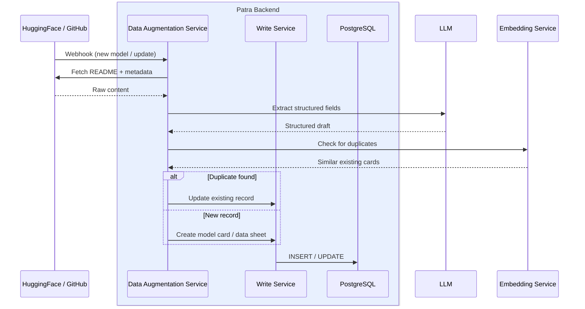
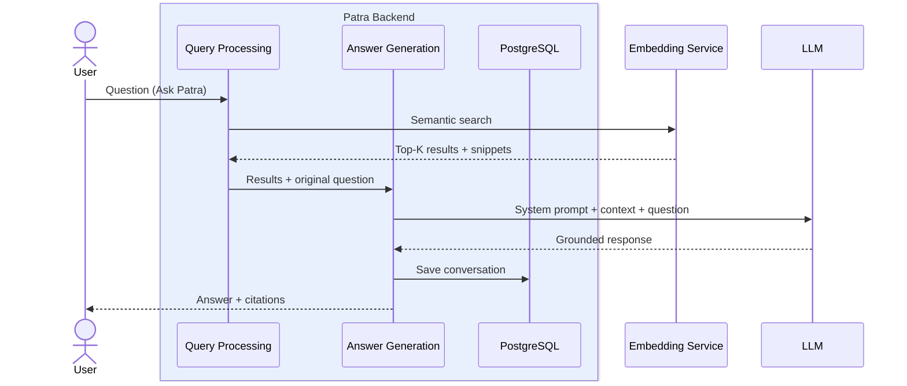
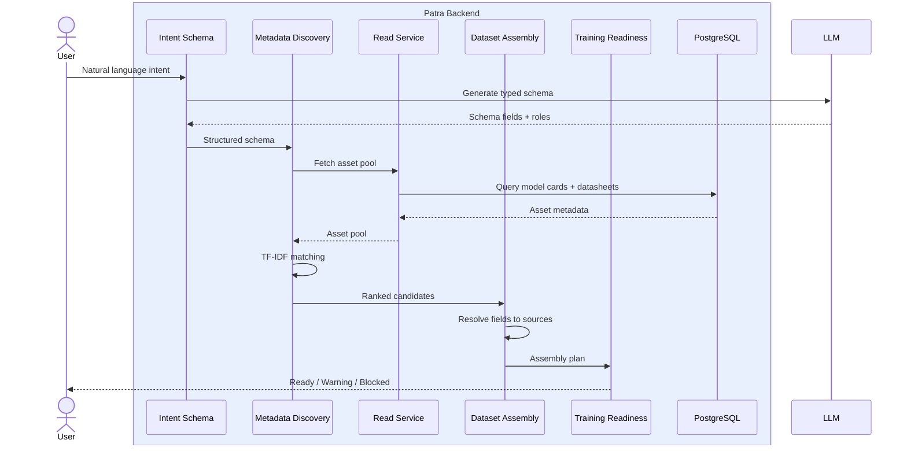
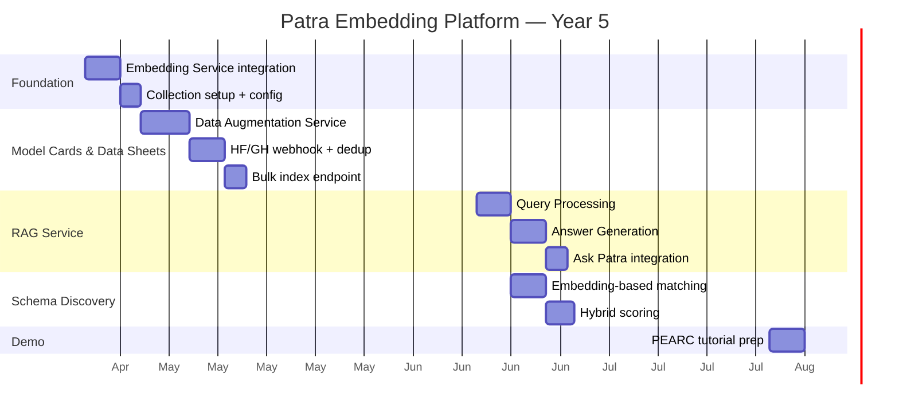

# Patra Embedding Platform — Executive Plan

## 1. Executive Summary

The Patra Embedding Platform adds semantic search and vector-powered retrieval to the Patra Knowledge Base, directly supporting three Year 5 deliverables already on the roadmap:

1. **Dataset Discovery for Experiment Reproducibility** (ACM REP'26) — find structurally and semantically similar datasets when original training data is missing. Today this uses sparse TF-IDF; embeddings make it semantic.
2. **Model Card Augmentation** — when ingesting from HuggingFace/GitHub, find similar existing cards to predict missing metadata fields. Embeddings enable "find cards like this one."
3. **"Model Card or Data Sheet for every artifact in ICICLE"** — semantic dedup and similarity detection prevent duplicate entries and surface related assets during ingestion.

**Approach:** Patra owns all embedding generation and retrieval logic. Vector storage uses the shared ICICLE Embedding Service (Amit, Christian) backed by Qdrant on Tapis — no new infrastructure for Patra to operate.

**What gets embedded:** Structured metadata already in PostgreSQL — model card fields (name, description, keywords, author, category, input/output data) and datasheet fields (title, creator, description, subjects). No blobs or raw files. PDF/document chunking is proposed as future work.

**Team:** Beth Plale (PI, UO), Neelesh Karthikeyan (UO), William Qiu (UO)

---

## 2. Architecture

**Patra Web App** — the frontend with four views:
- Read / Write Records (browse, edit, submit model cards and datasheets)
- Ask Patra (RAG-powered chat bot)
- MCP Explorer (inspect MCP tools and resources)
- Experiments (CKN experiment dashboards)

**Patra Backend** — three service groups plus PostgreSQL:

| Service Group | Components | Status |
|---|---|---|
| **Model Cards & Data Sheets** | Read Service, Write Service, 🤖 Data Augmentation Service | Read + Write existing; Data Augmentation planned |
| **RAG Service** | Query Processing, 🤖 Answer Generation | Planned |
| **Schema Discovery Service** | 🤖 Intent Schema, Metadata Discovery (TF-IDF), Dataset Assembly, Training Readiness | Planned |
| **MCP Service** | Read-only tools + resources over SSE | Existing |
| **PostgreSQL** | System of record for all structured metadata | Existing |

**Shared ICICLE Infrastructure** — external services Patra consumes:

| Component | Role |
|---|---|
| **Embedding Service** (Amit, Christian) | FastAPI + Qdrant. Stores/retrieves vector embeddings. Patra calls it for semantic search and duplicate detection. |
| **HuggingFace / GitHub** | Source for auto-import. Webhooks trigger Data Augmentation Service. |
| **CKN Broker** | Writes experiment events directly to PostgreSQL. |
| **MLHub + FlexServ** | Consumes Read Service for model/dataset discovery. |
| **HARVEST** | Registers models via Patra Web App. |
| **AI Studio** | Consumes Read Service for model card metadata. |

### Legend
- **Solid border** = existing component
- **Dashed border** = planned component
- **🤖** = uses LLM

---

## 3. How It Supports the Year 5 Roadmap

### 3.1 Dataset Discovery for Experiment Reproducibility

**Problem (ACM REP'26):** When the original training dataset is proprietary or missing, how do you find a structurally and semantically similar substitute?

**Today:** Sparse TF-IDF token-overlap matching. Misses semantic similarity — "customer_age" and "user_years" score zero overlap.

**With Embedding Platform:** The Schema Discovery pipeline gains dense vector matching via the Embedding Service. The Metadata Discovery step queries the Embedding Service to find semantically similar schemas, then continues through Dataset Assembly and Training Readiness as before.

### 3.2 HuggingFace / GitHub Model Card Ingestion

**Planned (May-Jun):** Ingest all model data from ICICLE's HuggingFace org. Webhook listener triggers extraction pipeline.

**Enhancement with Data Augmentation Service:**
- HuggingFace/GitHub webhook → Data Augmentation Service
- LLM extracts structured fields from raw README/metadata
- Embedding Service checks for duplicates (high similarity = flag)
- Nearest existing cards provide candidates to fill missing fields with confidence scores
- Data Augmentation Service → Write Service to create/update the record

### 3.3 Universal Model Card / Datasheet Coverage

**Planned:** "Model Card or Data Sheet for every AI/ML model and dataset in ICICLE."

**Enhancement:** The RAG Service's Query Processing calls the Embedding Service for semantic search. Any ICICLE project (MLHub, HARVEST, AI Studio) can discover Patra records by natural language query rather than exact keyword match.

---

## 4. Service Flows

### 4.1 Data Augmentation (write path)

### 4.2 RAG Chat Bot (read path)

### 4.3 Schema Discovery (analysis path)

---

## 5. Qdrant Collection Design

**Collection:** `patra_assets` — single collection, single tenant, inside the shared ICICLE Embedding Service

| Field | Type | Purpose |
|---|---|---|
| Point ID | `"{type}:{id}"` | Avoids collision (model_card:7 vs datasheet:7) |
| Vector | 384-dim float32 | Cosine similarity |
| `asset_type` | keyword | Filter by model_card or datasheet |
| `asset_id` | integer | FK to PostgreSQL |
| `name` | text | Display in results |
| `is_private` | bool | Privacy filtering |
| `text_snippet` | text | RAG context — avoids PG round-trip |

---

## 6. Alignment with Year 5 Timeline

| Sprint | Existing Plan | Embedding Platform Addition |
|---|---|---|
| **Mar-Apr** | Comparative study, datasheet 1st class node, schema representation | Foundation: Embedding Service integration, config, collection setup |
| **May-Jun** | HuggingFace ingestion, LLM augmentation, schema extensibility | Data Augmentation Service, semantic search API, bulk index. Duplicate detection during HF ingestion. |
| **Jul-Aug** | Vocabulary standardization, edge vocabulary, hardening | RAG Service (Query Processing + Answer Generation), PEARC demo prep |

### Implementation Phases

---

## 7. Integration with ICICLE Ecosystem

| ICICLE Component | How Patra Connects |
|---|---|
| **Embedding Service** (Amit, Christian) | Patra calls Store/Retrieve API for indexing and search. Qdrant is internal to the Embedding Service. |
| **HuggingFace / GitHub** | Webhooks trigger Data Augmentation Service for auto-import. |
| **MLHub + FlexServ** | Calls Read Service for model/dataset discovery. |
| **HARVEST** | Uses Patra Web App to register models. Semantic search makes them discoverable. |
| **AI Studio** | Calls Read Service for model card metadata. |
| **CKN Broker** | Writes experiment events directly to PostgreSQL. |
| **MCP Service** (existing) | Exposes Read Service + RAG as MCP tools for AI agents. |

---

## 8. Future Work (Post-August 2026)

| Item | Description |
|---|---|
| **Document chunking** | Chunk and embed PDFs, READMEs, papers linked to model cards. Requires file storage layer. |
| **Re-ranking** | Cross-encoder or LLM-based reranking of top-K retrieval results. |
| **Multi-tenant collections** | Per-project Qdrant isolation if ICICLE scale demands it. |
| **Patra-RGCN link prediction** | Graph neural networks predict missing relationships — embeddings provide node features. |
| **Embedding model fine-tuning** | Domain-specific model trained on ICICLE's model card/datasheet corpus. |
| **CKN experiment embedding** | Index experiment events for experiment-aware search. |

---

## 9. Success Criteria

| Criterion | Measurement |
|---|---|
| Semantic search returns relevant results | Manual eval on 20 queries across model cards + datasheets |
| Dataset discovery improves over TF-IDF | Side-by-side on existing schema pool (ACM REP'26 eval) |
| HuggingFace ingestion detects duplicates | Zero duplicate cards after bulk ICICLE HF import |
| RAG Chat Bot answers grounded in records | Responses include citations; no hallucinated cards |
| All existing behavior preserved | CI passes with embedding features disabled |
| Every ICICLE artifact has a card or sheet | Coverage metric tracked via bulk index count |
| Demo-ready for PEARC | End-to-end: upload card → search → chat |

---

## 10. Resources

| Person | Focus Area |
|---|---|
| **Neelesh** | Embedding Service integration, Data Augmentation Service, HF ingestion |
| **William** | RAG Service, MCP integration, privacy filtering |
| **Beth** | Schema Discovery upgrade, evaluation (ACM REP'26), PEARC demo |
| **Amit** (ICICLE) | Shared Embedding Service + Qdrant provisioning on Tapis |
