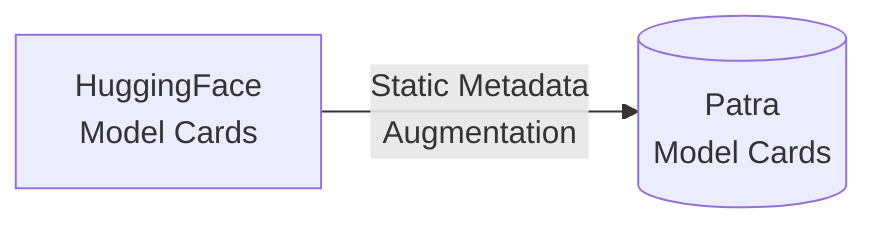
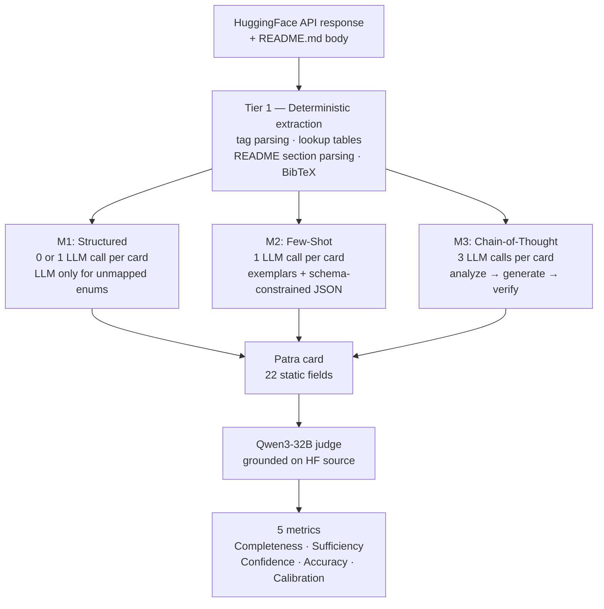
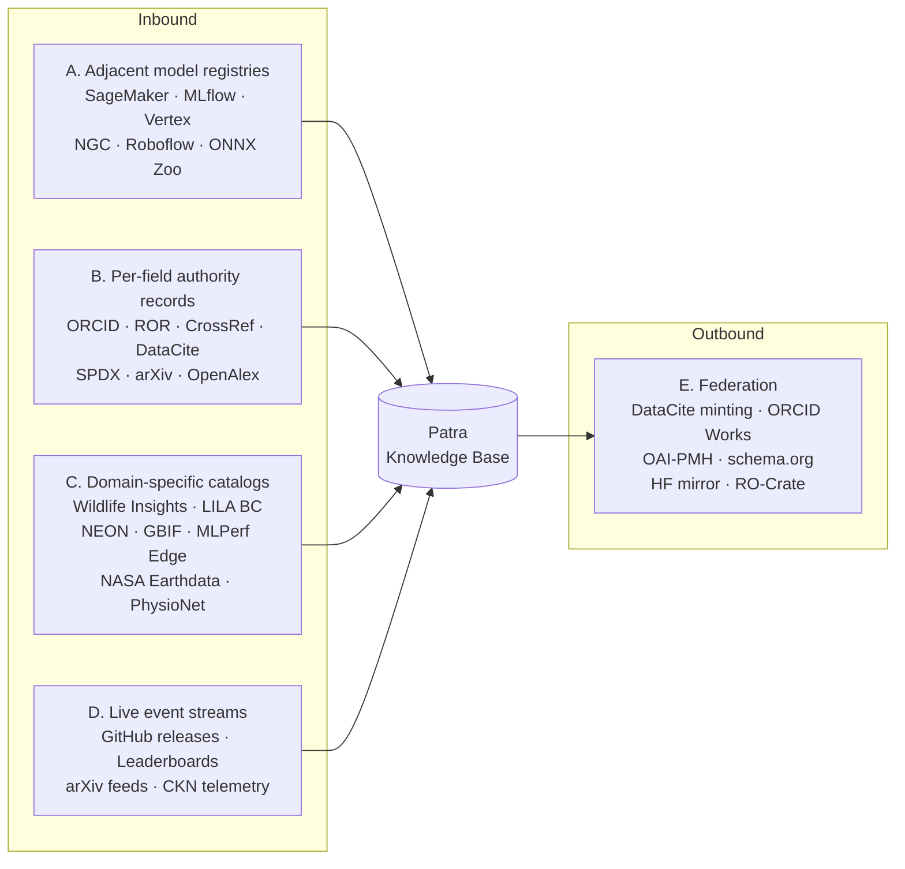

# LLM-Based Metadata Augmentation for ML Record Catalogs

---

## Problem

ML model cards and datasheets ingested into the Patra catalog from HuggingFace arrive with incomplete metadata. Fields critical for discoverability — descriptions, architecture classification, training data references — are frequently empty because HuggingFace's schema does not map 1:1 to Patra's DataCite-aligned schema. This study evaluates three augmentation approaches that combine deterministic extraction with LLM-based inference to fill these gaps.

### Pipeline



This study fills 22 static Patra fields from HuggingFace API responses + README content using LLM-assisted augmentation. Three approaches (M1, M2, M3) are compared along five metrics.

## Patra Model Card Schema

`*` = required by the backend. The `runtime` block is populated from CKN edge-deployment data.

| # | Field | Type              | Notes |
|---|---|-------------------|---|
| 1 | `id` | int                 | Catalog-assigned ID |
| 2 | `name*` | string            | Model card name |
| 3 | `version*` | string            | Model card version |
| 4 | `short_description*` | string            | Brief description |
| 5 | `full_description*` | string            | Comprehensive description |
| 6 | `keywords*` | string            | Comma-separated search keywords |
| 7 | `author*` | string            | Author or creator |
| 8 | `input_data*` | url / DOI / null  | Link to input dataset |
| 9 | `input_type*` | string            | e.g. `Image`, `Text`, `Audio` |
| 10 | `output_data*` | url / DOI / null  | Link to output dataset |
| 11 | `ai_model.name*` | string            | Model name |
| 12 | `ai_model.version*` | string            | Model version |
| 13 | `ai_model.description*` | string            | Model description |
| 14 | `ai_model.owner*` | string            | Model owner / org |
| 15 | `ai_model.location*` | string            | Downloadable URL |
| 16 | `ai_model.license*` | string            | License identifier (e.g. `apache-2.0`) |
| 17 | `ai_model.framework*` | enum              | `sklearn` · `tensorflow` · `pytorch` · `other` |
| 18 | `ai_model.model_type*` | enum              | `cnn` · `decision_tree` · `dnn` · `rnn` · `svm` · `kmeans` · `llm` · `random_forest` · `lstm` · `gnn` · `other` |
| 19 | `ai_model.test_accuracy*` | number            | Test-set accuracy |
| 20 | `ai_model.model_structure` | object            | Free-form architecture details (e.g. backbone, input shape) |
| 21 | `ai_model.model_metrics` | `{key, value}[]`  | Additional named metrics |
| 22 | `ai_model.inference_labels` | string            | Inference label(s) |
| 23 | `category` | enum (28 values)  | e.g. `classification`, `computer vision`, `natural language processing` |
| 24 | `citation` | string            | Citation / BibTeX |
| 25 | `documentation` | string            | Documentation URL |
| 26 | `foundational_model` | string            | ID of base/foundational model |
| 27 | `model_requirements` | string[] / null   | Dependency strings (e.g. `torch==2.1.0`) |
| 28 | `bias_analysis` | object / null     | `demographic_parity_diff`, `equal_odds_difference` |
| 29 | `xai_analysis` | object / null     | `bias_metrics[]` — `{key, value}` pairs |
| 30 | `is_private` | boolean           | Default `false`. Excludes card from public search. |
| 31 | `is_gated` | boolean           | Default `false`. Model download requires approval; card stays discoverable. |
| 32 | `experiments[].experiment_id*` | string            | CKN experiment identifier |
| 33 | `experiments[].device_id*` | string            | CKN edge device identifier |
| 34 | `experiments[].user_id*` | string            | CKN user identifier |
| 35 | `experiments[].model_id*` | string            | CKN model identifier |
| 36 | `experiments[].image_receiving_timestamp` | date-time / null  | First image received |
| 37 | `experiments[].image_scoring_timestamp` | date-time / null  | Most recent scoring event |
| 38 | `experiments[].total_images` | integer / null    | Running total |
| 39 | `experiments[].total_predictions` | integer / null    | Running total |
| 40 | `experiments[].total_ground_truth_objects` | integer / null    | Running total |
| 41 | `experiments[].true_positives` | integer / null    | Running total |
| 42 | `experiments[].false_positives` | integer / null    | Running total |
| 43 | `experiments[].false_negatives` | integer / null    | Running total |
| 44 | `experiments[].precision` | number 0–1 / null | Terminal value |
| 45 | `experiments[].recall` | number 0–1 / null | Terminal value |
| 46 | `experiments[].f1_score` | number 0–1 / null | Terminal value |
| 47 | `experiments[].mean_iou` | number 0–1 / null | Detection models only |
| 48 | `experiments[].map_50` | number 0–1 / null | mAP @ IoU 0.50 |
| 49 | `experiments[].map_50_95` | number 0–1 / null | mAP @ IoU 0.50–0.95 |
| 50 | `experiments[].power_summary.image_generating_plugin_cpu_power_consumption` | number / null     | Watts |
| 51 | `experiments[].power_summary.image_generating_plugin_gpu_power_consumption` | number / null     | Watts |
| 52 | `experiments[].power_summary.power_monitor_plugin_cpu_power_consumption` | number / null     | Watts |
| 53 | `experiments[].power_summary.power_monitor_plugin_gpu_power_consumption` | number / null     | Watts |
| 54 | `experiments[].power_summary.image_scoring_plugin_cpu_power_consumption` | number / null     | Watts |
| 55 | `experiments[].power_summary.image_scoring_plugin_gpu_power_consumption` | number / null     | Watts |
| 56 | `experiments[].power_summary.total_cpu_power_consumption` | number / null     | Sum of all CPU plugin watts |
| 57 | `experiments[].power_summary.total_gpu_power_consumption` | number / null     | Sum of all GPU plugin watts |

**57 fields · 18 required**

```json
{
  "name": "MegaDetector",
  "version": "5.0",
  "short_description": "General-purpose object detector for camera-trap images, classifying detections as animal, human, or vehicle.",
  "full_description": "MegaDetector v5 is a PyTorch YOLOv5-based model trained by Microsoft AI for Earth on millions of camera-trap images across diverse ecosystems. It detects and localises animals, humans, and vehicles with high recall on unseen camera deployments.",
  "keywords": "camera-trap, object-detection, wildlife, megadetector, yolov5",
  "author": "Microsoft AI for Earth",
  "input_data": "https://lila.science/datasets/camera-traps-community-datasets",
  "input_type": "Image",
  "output_data": null,
  "id": "7",
  "category": "computer vision",
  "citation": "Beery et al. (2019) — Efficient Pipeline for Camera Trap Image Processing",
  "documentation": "https://github.com/microsoft/CameraTraps/blob/main/megadetector.md",
  "foundational_model": "YOLOv5",
  "model_requirements": ["torch==2.1.0", "torchvision==0.16.0", "yolov5==7.0"],
  "is_private": false,
  "is_gated": false,
  "bias_analysis": {
    "demographic_parity_diff": 0.01,
    "equal_odds_difference": 0.02
  },
  "xai_analysis": {
    "bias_metrics": [
      { "key": "gradcam_coverage", "value": "0.88" }
    ]
  },
  "ai_model": {
    "name": "MegaDetector",
    "version": "5.0",
    "description": "YOLOv5-based detector for camera-trap images; outputs bounding boxes with class (animal / human / vehicle) and confidence.",
    "owner": "Microsoft AI for Earth",
    "location": "https://github.com/microsoft/CameraTraps/releases/tag/v5.0",
    "license": "MIT",
    "framework": "pytorch",
    "model_type": "cnn",
    "test_accuracy": 0.943,
    "model_structure": { "backbone": "YOLOv5x6", "input_size": "1280x1280", "classes": 3 },
    "model_metrics": [
      { "key": "mAP@0.5", "value": "0.943" },
      { "key": "recall_animal", "value": "0.961" }
    ],
    "inference_labels": "animal, human, vehicle"
  },
  "experiments": [
    {
      "experiment_id": "megadetector-iu-animal-classification",
      "device_id": "iu-edge-server-cib",
      "user_id": "beckstei",
      "model_id": "microsoft/MegaDetector",
      "image_receiving_timestamp": "2026-03-10T08:00:00Z",
      "image_scoring_timestamp": "2026-03-10T08:04:37Z",
      "total_images": 500,
      "total_predictions": 487,
      "total_ground_truth_objects": 500,
      "true_positives": 463,
      "false_positives": 24,
      "false_negatives": 37,
      "precision": 0.95062,
      "recall": 0.92600,
      "f1_score": 0.93815,
      "mean_iou": 0.81200,
      "map_50": 0.94300,
      "map_50_95": 0.71800,
      "power_summary": {
        "image_generating_plugin_cpu_power_consumption": 2.8,
        "image_generating_plugin_gpu_power_consumption": 0.1,
        "power_monitor_plugin_cpu_power_consumption": 2.6,
        "power_monitor_plugin_gpu_power_consumption": 0.07,
        "image_scoring_plugin_cpu_power_consumption": 2.9,
        "image_scoring_plugin_gpu_power_consumption": 14.3,
        "total_cpu_power_consumption": 8.3,
        "total_gpu_power_consumption": 14.47
      }
    }
  ]
}
```

## HuggingFace Schema

Fields returned by the HuggingFace Hub list endpoint (`GET https://huggingface.co/api/models`) and stored as `hf_api_response` in `poc/real_hf_cards.json`.

| # | Field | Type | Notes |
|---|---|---|---|
| 1 | `_id` | string | HuggingFace internal ObjectId |
| 2 | `id` | string | Repository ID, e.g. `microsoft/MegaDetector` (`author/repo`) |
| 3 | `modelId` | string | Duplicate of `id` |
| 4 | `createdAt` | date-time | Repo creation timestamp |
| 5 | `lastModified` | date-time | Latest commit timestamp |
| 6 | `pipeline_tag` | string | HuggingFace task, e.g. `object-detection`, `text-classification` |
| 7 | `library_name` | string | Framework, e.g. `transformers`, `pytorch`, `sentence-transformers` |
| 8 | `tags` | string[] | Tag array — includes `arxiv:<id>`, `dataset:<id>`, `license:<id>` prefixed tags |
| 9 | `downloads` | integer | 30-day download count |
| 10 | `likes` | integer | User like count |
| 11 | `private` | boolean | Hidden from public search |

**11 fields**. The pipeline additionally fetches `README.md` as a separate file read from the repo and feeds it into the LLM as additional context for prose, BibTeX, and section parsing — but the README is not part of the API response.

```json
{
  "_id": "621ffdc136468d709f180294",
  "id": "microsoft/MegaDetector",
  "modelId": "microsoft/MegaDetector",
  "createdAt": "2021-06-15T09:12:33.000Z",
  "lastModified": "2024-08-22T14:07:51.000Z",
  "pipeline_tag": "object-detection",
  "library_name": "yolov5",
  "tags": [
    "object-detection",
    "yolov5",
    "pytorch",
    "camera-trap",
    "wildlife",
    "license:mit",
    "arxiv:1907.06772",
    "dataset:lila-bc"
  ],
  "downloads": 12837,
  "likes": 412,
  "private": false
}
```

## Experiment Setup

| Component | Details |
|---|---|
| **Dataset** | 20 real HuggingFace records: 10 model cards (5 popular + 5 sparse <1000 downloads) + 10 datasheets (5 popular + 5 sparse) |
| **Generator LLM** | Llama 4-17B via LiteLLM on TACC Tapis |
| **Judge LLM** | Qwen3-32B (different model family, `enable_thinking: False`) |
| **Model card fields** | 22 augmentable Patra fields |
| **Datasheet fields** | 12 augmentable Patra fields |

## Evaluation Framework

### Five Metrics

**Metric 1: Completeness** — fraction of augmentable fields with a non-null value.

```
Completeness(record) = |{f ∈ Fields : value(f) ≠ null}| / |Fields|
```

**Metric 2: Sufficiency** — fraction of required fields filled. Required fields are the minimum set for a record to be findable in catalog search.

```
Sufficiency(record) = |{f ∈ Required : value(f) ≠ null}| / |Required|
```

MC Required (8): `name`, `category`, `input_type`, `keywords`, `author`, `short_description`, `ai_model_license`, `ai_model_framework`

DS Required (5): `title`, `description`, `subjects`, `resource_type_general`, `creator`

**Metric 3: Attribute Confidence** — pipeline's self-assessed certainty per field, assigned at augmentation time. Not a formula over other metrics — directly reflects extraction source reliability.

| Extraction source | Confidence |
|---|---|
| Direct copy (name, author, booleans, URLs) | 1.00 |
| Lookup table match (pipeline_tag found in mapping) | 0.95 |
| README extraction (section parsing, BibTeX) | 0.90 |
| Lookup table fallback (mapped to "other") | 0.60 |
| LLM-generated (model self-reports c_llm) | c_llm (0 to 1) |
| Empty | 0.00 |

**Metric 4: Overall Confidence** — mean of all Attribute Confidences across a record.

```
OverallConf(record) = (1/|Fields|) × Σ AttrConf(f_i)
```

Empty fields contribute 0.0, pulling the mean down. This creates a natural tension: filling more fields with low-confidence guesses can *lower* Overall Confidence.

**Metric 5: Accuracy** — external quality evaluation from a judge LLM.

| Judge score | Accuracy value | Meaning |
|---|---|---|
| 0 | 0.0 | Wrong or misleading |
| 1 | 0.5 | Acceptable but imprecise |
| 2 | 1.0 | Correct, source-supported |

Only filled fields are judged. Empty fields do not receive an Accuracy score.

**Calibration gap** = |OverallConf − mean(Accuracy)|. A well-calibrated pipeline has gap ≈ 0. A gap > 0.05 indicates overconfidence.

### Judge Design

The judge uses a different model family (Qwen3-32B) from the generator (Llama 4-17B) to avoid self-enhancement bias. All filled fields for a card are judged in a single batched API call.

**Judge prompt** (sent once per card with all filled fields):

~~~
Given this HuggingFace model's API metadata and README, score EACH augmented field below.

## HuggingFace API metadata
{hf_json — first 1500 chars}

## README excerpt
{readme — first 2000 chars}

## Fields to evaluate
{
  "field_name": {"value": "augmented_value", "description": "field schema description"},
  ...
}

## Scoring rubric (apply to EACH field)
0 = wrong, misleading, or contradicted by source material
1 = acceptable but imprecise, or correct from general knowledge but not in source
2 = correct and directly supported by source material

Return ONLY JSON — an object with field names as keys:
{
  "field_name_1": {"score": N, "reason": "one sentence"},
  "field_name_2": {"score": N, "reason": "one sentence"},
  ...
}
~~~

**Judge parameters**: temperature=0.0, max_tokens=1500, `enable_thinking: False`

**Cost**: 1 API call per card (not per field). Total: ~30 calls for 3 methods × 10 cards × 2 asset types.

## Three Approaches

All three methods share a common Tier 1 deterministic extraction phase and differ in how Tier 2 uses the LLM.



### Method 1: Structured Extraction (minimal LLM)

Extract everything deterministically. LLM used only as classifier for enum fields when lookup tables fail.

**Phase 1 — Deterministic extraction pipeline:**

~~~
1. Tag prefix parsing:
   "arxiv:2405.04434"               → citation = "https://arxiv.org/abs/2405.04434"
   "base_model:meta-llama/Llama-3"  → foundational_model = "Llama-3"
   "dataset:imagenet-1k"            → input_data = "https://huggingface.co/datasets/imagenet-1k"
   "license:apache-2.0"             → ai_model_license = "apache-2.0"

2. README YAML frontmatter:
   base_model: Qwen/Qwen3-0.6B-Base  → foundational_model = "Qwen3-0.6B-Base"
   license: apache-2.0               → ai_model_license (if not already set)

3. README section parsing:
   Find "## Model Description" or "## About" or "## Overview"
   → short_description = first paragraph (≤200 chars)
   → full_description = first 2-3 paragraphs (≤800 chars)
   Fallback: first prose paragraphs after title if no heading match

4. README BibTeX extraction:
   Find ```bibtex ... ``` block → citation (confidence = 0.9)

5. Lookup tables:
   pipeline_tag → category (27-value Patra enum) + input_type
   library_name → ai_model_framework (sklearn/tensorflow/pytorch/other)
   config.model_type → ai_model_model_type (cnn/dnn/llm/gnn/etc.)

6. Direct copies:
   repo_id.split("/")[-1] → name
   repo_id.split("/")[0]  → author, ai_model_owner
   "https://huggingface.co/{repo_id}" → documentation, ai_model_location
   private → is_private
   gated → is_gated
~~~

**Phase 2 — LLM classification (only when Phase 1 fails):**

The LLM is called ONLY for `category`, `input_type`, and `ai_model_model_type` when the corresponding lookup table source (`pipeline_tag`, `config.model_type`) is absent. The prompt is the same baseline template used by all methods (see below).

**LLM calls per card**: 0-1 (only if pipeline_tag missing)

### Method 2: Few-Shot Retrieval + Schema-Constrained Generation

Same Phase 1 as M1. Then LLM fills ALL remaining null fields guided by exemplar completed cards.

**Phase 2 — Few-shot LLM generation:**

Exemplars are the first 3 augmented cards from M1's output (bootstrapped — no dependency on external catalog).

**Prompt template:**

~~~
You are a metadata specialist for the Patra ML model catalog.

Here are 3 examples of completed Patra model cards to learn the format and style:

### Example 1
{exemplar_1_json}

### Example 2
{exemplar_2_json}

### Example 3
{exemplar_3_json}

Now augment this new model card. Fill in ONLY the missing fields listed below,
matching the style of the examples above.

## HuggingFace API response
{hf_json}

## README.md content
{readme_body — first 3000 chars}

## Fields already extracted (do NOT change these)
{extracted_json — non-null fields}

## Fields to fill (generate values matching the exemplar style)
{missing_fields_json — field name: description}

## Schema constraints
- "category" must be one of: classification, regression, ... (27 values)
- "ai_model_framework" must be one of: sklearn, tensorflow, pytorch, other
- "ai_model_model_type" must be one of: cnn, dnn, llm, gnn, ... (11 values)

Return ONLY valid JSON:
{
  "augmented_fields": {
    "<field_name>": {
      "value": "<your value or null>",
      "confidence": 0.85,
      "reasoning": "<one sentence>"
    }
  }
}
~~~

**LLM parameters**: model=llama4-17b, temperature=0.2, max_tokens=1500

**LLM calls per card**: 1

### Method 3: Chain-of-Thought + Self-Verification

Same Phase 1 as M1. Then 3 sequential LLM passes.

**Pass 1 — Analysis** (temperature=0.2, max_tokens=800):

~~~
You are analyzing a HuggingFace model to prepare metadata for the Patra ML catalog.

## HuggingFace API response
{hf_json}

## README.md content
{readme_body — first 3000 chars}

Analyze this model and answer these questions:
1. What type of model is this? (architecture family, task type, domain)
2. What data was it trained on?
3. What are its key capabilities?
4. What are its limitations?
5. Who created it and why?
6. Is it a fine-tune of another model? If so, which base model?

Write a structured analysis. Do NOT fill any catalog fields yet — just reason
about what you know.
~~~

Returns free-text analysis (not JSON).

**Pass 2 — Field generation** (temperature=0.2, max_tokens=1500):

~~~
Based on your analysis below, fill in these Patra catalog fields.

## Your analysis
{analysis_text_from_pass_1}

## Fields already extracted (do NOT change these)
{extracted_json}

## Fields to fill
{missing_fields_json}

## Schema constraints
- "category" must be one of: classification, regression, ... (27 values)
- "ai_model_framework" must be one of: sklearn, tensorflow, pytorch, other
- "ai_model_model_type" must be one of: cnn, dnn, llm, gnn, ... (11 values)

For each field, explain your reasoning. If you cannot infer a value, set it to
null with confidence 0.0.

Return ONLY valid JSON:
{
  "augmented_fields": {
    "<field_name>": {
      "value": "<your value or null>",
      "confidence": 0.85,
      "reasoning": "<one sentence>"
    }
  }
}
~~~

Returns JSON with field values + confidence + reasoning.

**Pass 3 — Consistency verification** (temperature=0.0, max_tokens=500):

~~~
Review these augmented Patra catalog fields for internal consistency.

## All fields (extracted + generated)
{all_fields_json — merged from Phase 1 + Pass 2}

Check:
1. Does category match input_type? (e.g., "classification" + "Image" = OK)
2. Does ai_model_model_type match foundational_model? (e.g., "llm" + "Llama" = OK)
3. Does the description accurately reflect the category and input_type?
4. Are there any contradictions between fields?

Return ONLY valid JSON:
{
  "corrections": [
    {"field": "<name>", "old_value": "<current>", "new_value": "<corrected>", "reason": "<why>"}
  ],
  "consistent": true/false
}
~~~

Returns corrections list. Applied to Pass 2 output. Corrected fields get confidence reduced by 0.1.

**LLM calls per card**: 3

---

## Results

### Overview


#### Summary Table

| | M1: Structured | M2: Few-Shot | M3: CoT |
|---|---|---|---|
| **MC Completeness** | 0.86 | **0.95** | 0.92 |
| **MC Confidence** | 0.83 | **0.89** | 0.87 |
| **MC Accuracy (Judge)** | 0.82 | 0.79 | **0.86** |
| **DS Completeness** | 0.64 | **0.88** | 0.67 |
| **DS Confidence** | 0.55 | **0.75** | 0.57 |
| **DS Accuracy (Judge)** | **0.82** | 0.75 | 0.77 |

**Key observation**: M2 leads on Completeness and Confidence but trails on Accuracy. The judge reveals that filling more fields does not mean filling them correctly. M2 is overconfident.

### Attribute Confidence by Field


**Interpretation**: The heatmaps show where each method is confident vs uncertain. For model cards, 9 fields score 1.0 across all methods (deterministic extraction — name, author, documentation, booleans). The differentiation is in the remaining fields: `foundational_model` (M1: 0.18 → M3: 0.88), `ai_model_model_type` (M1: 0.55 → M3: 0.90), `input_data` (M1: 0.36 → M2: 0.44).

For datasheets, M2 shows uniformly higher confidence (0.83-0.90 for LLM fields) while M1 and M3 show more variance. This high uniform confidence from M2 is a calibration red flag — the judge confirms these values are less accurate than M2's confidence suggests.

### Field Coverage


**Interpretation**: Coverage shows the raw "did you fill it?" dimension. M2 achieves 100% coverage on most model card fields and most datasheet fields. M1 leaves clear gaps: `foundational_model` (20%), `input_data` (40%), `ai_model_model_type` (60%). M3 fills these gaps for model cards (100% on all three) but is less consistent on datasheets (`publisher`: 30%, `format`: 20%).

**Decision point**: For production deployment, the coverage gap between M1 (0.86 MC) and M2 (0.95 MC) matters for user experience — a catalog with 14% empty fields is noticeably worse than 5% empty. But filling fields incorrectly (M2's 10% overconfidence gap) is worse than leaving them empty.

### Confidence vs Coverage


**Interpretation**: The scatter plots show each field as a point. The bottom-left quadrant (low confidence + low coverage) identifies pipeline failures. For model cards, `foundational_model` and `input_data` cluster in the bottom-left for M1 but move to the upper-right for M2/M3. For datasheets, `size`, `format`, and `license` remain in the bottom-left across all methods — these are genuinely hard fields with no reliable source.

---

## Calibration Analysis

The most significant finding: **Attribute Confidence calibration varies dramatically by method.**

| Method | MC Confidence | MC Accuracy | Gap | Interpretation |
|---|---|---|---|---|
| M1 | 0.83 | 0.82 | **0.01** | Well-calibrated — the pipeline knows what it knows |
| M2 | 0.89 | 0.79 | **0.10** | Overconfident — few-shot exemplars inflate confidence |
| M3 | 0.87 | 0.86 | **0.01** | Well-calibrated — reasoning + verification keeps honesty |

**Why M2 is overconfident**: The few-shot exemplars show the LLM what a "completed" card looks like. The LLM mimics the confident format of the exemplars and reports high confidence for generated values, even when they're imprecise or wrong. This is a known failure mode of in-context learning — the model confuses stylistic similarity with factual accuracy.

**Why M3 is well-calibrated**: The verification pass (Pass 3) catches inconsistencies and reduces confidence on corrected fields. The analysis pass (Pass 1) forces the model to reason about uncertainty before generating, which produces more calibrated self-assessments.

**Implication for production**: A deployed system needs calibrated confidence scores so downstream consumers (search UI, admin review) can trust them. M1 and M3 are trustworthy; M2 would need post-hoc calibration.

---

## Per-Field Accuracy (Judge)

### Model Cards — Fields Where Methods Differ

| Field | M1 Acc | M2 Acc | M3 Acc | Best | Reasoning |
|---|---|---|---|---|---|
| `foundational_model` | 0.75 | 0.78 | **0.85** | M3 | CoT analysis explicitly reasons about architecture |
| `ai_model_model_type` | 0.54 | 0.55 | **0.75** | M3 | Classification from name + tags needs reasoning |
| `output_data` | 0.93 | **0.95** | **0.95** | M2/M3 | Both fill correctly when M1 leaves gaps |
| `ai_model_framework` | **0.85** | 0.80 | 0.80 | M1 | Deterministic lookup is more accurate than LLM |
| `input_data` | 0.88 | 0.70 | **1.00** | M3 | CoT asks "what data?" directly; few-shot misleads |

### Datasheets — Fields Where Methods Differ

| Field | M1 Acc | M2 Acc | M3 Acc | Best | Reasoning |
|---|---|---|---|---|---|
| `description` | **0.64** | 0.60 | 0.56 | M1 | README text > LLM paraphrase |
| `subjects` | **0.79** | 0.60 | 0.56 | M1 | Tag extraction > LLM generation |
| `publisher` | **1.00** | 0.95 | 0.83 | M1 | When extracted, always correct |
| `resource_type_general` | 0.86 | **0.95** | 0.80 | M2 | Exemplars teach DataCite vocab |
| `format` | **0.75** | 0.58 | 0.50 | M1 | Deterministic format detection wins |

**Pattern**: For datasheets, M1 wins on accuracy for 4 of 8 fields that differ. LLM methods generate plausible but imprecise descriptions and subjects. For model cards, M3 wins on inference-heavy fields (architecture, model type, training data) where reasoning before generation helps.

---

## Decisions Taken

| Decision | Rationale |
|---|---|
| **Use M1 as default pipeline** | Best calibration (0.01 gap), highest DS accuracy, zero LLM cost for 13/22 MC fields |
| **Use M3 selectively for 3 fields** | `foundational_model` (0.85 acc), `ai_model_model_type` (0.75 acc), `input_data` (1.00 acc) — the fields M1 can't fill where M3 demonstrably improves |
| **Do not deploy M2 without calibration fix** | 0.10 overconfidence gap makes confidence scores untrustworthy for downstream consumers |
| **Never LLM-generate citations** | All methods extract citations deterministically from arXiv tags + README BibTeX. Coverage is 60% — the remaining 40% stays null rather than hallucinated |
| **Use different model families for judge vs generator** | Qwen3-32B judging Llama 4-17B avoids self-enhancement bias. Both available on Tapis LiteLLM |
| **Batch judge calls (1 per card, not per field)** | 19× reduction in API calls. Same quality, ~45 sec instead of ~14 min |

## Planned Next Steps

| Step | What | Why | Status |
|---|---|---|---|
| **Scale to 100 cards** | 50 popular + 50 sparse models + datasets | Validate findings at larger scale. 10 cards may not be representative. | Pending |
| **Implement hybrid M1+M3** | M1 for all fields, then M3 only for null `foundational_model`, `model_type`, `input_data` | Best of both: M1's calibration + M3's inference accuracy | Pending |
| **Fix M2 calibration** | Post-hoc confidence adjustment using judge scores as training signal | If M2's completeness advantage can be preserved with corrected confidence | Research |
| **Human evaluation on 20 cards** | Expert annotates 20 augmented cards to validate judge reliability | The judge is an LLM — need to verify it correlates with human judgment | Pending |
| **Datasheet augmentation improvement** | Better README section parsing for datasets, format inference from repo file listing | DS Completeness (0.64) is significantly lower than MC (0.86) | Research |
| **Webhook integration** | Deploy M1+M3 hybrid behind `POST /webhooks/huggingface` endpoint | Move from POC to production. Auto-augment on HF push events. | Planned |
| **MCP agent (Approach C)** | LLM agent with MCP tools decides own retrieval strategy per card | Agent adapts retrieval (arXiv, Semantic Scholar, HF README) per card's needs | Future |

## Infrastructure

| Component | Details |
|---|---|
| Generator LLM | Llama 4-17B via LiteLLM on TACC Tapis |
| Judge LLM | Qwen3-32B via LiteLLM on TACC Tapis |
| Auth | Tapis OAuth2 token exchange (`X-Tapis-Token` header) |
| Available models | llama4-17b, qwen3-32b, llama3.3-70b-instruct, mistral-7b-instruct |
| Dataset | 20 real HF records in `poc/real_hf_cards.json` |
| Code | `poc/augment_poc_v2.py`, `poc/judge_augmented.py`, `poc/visualize_metrics.py` |
| Results | `poc/metrics_comparison.csv`, `poc/judge_scores.csv`, `poc/results_*.json` |

---

## Future Work

Roadmap for the HF → Patra augmentation pipeline. Items grouped by theme, ordered roughly by leverage (impact / effort).

### 1. Apply the measured findings — lowest-effort, highest-confidence fixes

| Fix | Closes | Effort |
|---|---|---|
| Implement the M1+M3 hybrid pipeline (already decided, not yet built) | M1 calibration + M3 inference accuracy in one pass | 1 day |

### 2. Validate at scale

| Step | Why | Status |
|---|---|---|
| Scale corpus to 50–100 cards | Current N=10 mixes 5 popular + 5 sparse. Validate that the calibration gap stays ≤ 0.05 on broader distributions | Pending |
| Variance analysis — run M1/M2/M3 three times each on the same 10 cards | Quantify run-to-run accuracy stochasticity from LLM temperature | Pending |
| Human evaluation on 20 cards | Expert annotates ground truth so we can verify the Qwen3-32B judge actually correlates with human judgment (currently judge is treated as oracle) | Pending |
| Cross-judge agreement | Re-judge the same outputs with Qwen3-32B + Llama 3.3-70B + Mistral-7B; report inter-rater agreement κ | Pending |

### 3. Live data integration

| Step | What | Status |
|---|---|---|
| Run on the live Patra catalog | End-to-end on every card the catalog actually holds, not just the curated 20-record fixture | Pending |

### 4. Extend schema coverage

| Step | What | Status |
|---|---|---|
| Backfill `model_requirements` in step 1 | M1/M2/M3 don't currently target this Patra field. Adding it would close a data gap for downstream consumers | Pending |
| Datasheet augmentation improvement | Better README section parsing for datasets, format inference from repo file listing. DS Completeness (0.64) is significantly lower than MC (0.86) | Research |

### 5. New methods (Approach C and beyond)

| Step | Why | Status |
|---|---|---|
| **MCP agent (Approach C)** | LLM agent decides per-card whether to query arXiv, Semantic Scholar, or the HF README. Adapts retrieval strategy per card's needs | Future |
| Active learning loop | Feed judge scores back into prompt design. Cards that consistently fail certain fields trigger prompt refinement automatically | Research |
| Cross-method ensembles | For each field, pick the method with the highest historical accuracy. Currently §Decisions Taken does this manually for 3 fields; could be data-driven and generalized | Research |

### 6. Calibration deep-dives

| Step | Why | Status |
|---|---|---|
| Per-card calibration breakdown | Measure where the gap accumulates within a single card's fields, not just across the corpus | Pending |
| M2 overconfidence root cause | Current explanation: "few-shot exemplars confuse stylistic similarity with factual accuracy." Validate by ablating — same exemplars but stripped of confidence values | Research |
| Calibration over time | Re-judge older augmented cards after schema/lookup updates. Does the gap drift as the catalog grows? | Research |
| Fix M2 calibration via post-hoc adjustment | Use judge scores as a training signal to recalibrate M2's overconfident predictions. Preserves M2's completeness advantage if it works | Research |

### 7. Production deployment

| Step | What | Status |
|---|---|---|
| **Webhook integration** | `POST /webhooks/huggingface` endpoint that auto-augments on HF push events | Planned |
| Confidence-gated auto-publish | Fields with `attr_confidence ≥ 0.85` auto-fill the catalog; `0.40–0.85` enter a human-review queue; `< 0.40` stay null | Planned |
| Cost tracking | Quantify $/card across methods on the live LiteLLM endpoint. Compare M1's near-zero LLM cost to M3's 3-call cost vs measured accuracy lift | Pending |
| Batch + cache | Reuse LLM outputs for cards in the same `(category, input_type)` bucket; batch multiple cards in a single LLM call where prompts allow | Pending |

---

## Beyond HuggingFace: Expansion Landscape

The HF → Patra augmentation pipeline (M1/M2/M3) is the *first* extractor in what should become a multi-source ingestion system. The project-level [`docs/DATA_AUGMENTATION_DESIGN.md`](../../../docs/DATA_AUGMENTATION_DESIGN.md) already lists six priority sources (SageMaker → Google MCT → MLflow → Papers With Code → Croissant → Kaggle/OpenML) and a generalized Phase-1-extractor architecture. This section widens that lens to:

1. **Per-field authority records** — ORCID, ROR, CrossRef, DataCite, SPDX, arXiv, OpenAlex. The Patra schema is DataCite-shaped, so fields like `funder_identifier_scheme` or `name_identifier` are best filled by authority lookups, not LLM inference.
2. **Domain-specific catalogs** matched to ICICLE's actual users — camera-trap models, agricultural sensor networks, edge-AI benchmarks. The sources researchers reach for first don't appear on any general model registry.
3. **Live event streams** beyond webhooks — GitHub release feeds, leaderboards, conference proceedings, MLPerf result drops. Static cards drift; streams keep them fresh.
4. **Outbound federation** — Patra as a producer, not just consumer. Mint DataCite DOIs for Patra cards. Push to ORCID Works. Expose OAI-PMH. Embed schema.org JSON-LD so Google Dataset Search indexes Patra. RO-Crate exports for grant deliverables.
5. **Strategic role evolution** — beyond ingestion, what is Patra *for*? AIBOM/SBOM-for-models for federal compliance, inference proxy/router as an active platform, risk register for failure-mode tracking, and (deferred) multi-tenant federation.
6. **The use-case lens** — sources are means, not ends. Personas (researcher, edge engineer, cross-institution collaborator, AI auditor, domain expert) drive different priority orderings.

### Ecosystem reality check (grounded in `/learning/` repo audit)

Before recommending priorities, what's actually true today, surfaced from auditing CKN, camera-traps, patra-frontend, patra-toolkit, ml-hub-rust, and the Neo4j-era patra-knowledge-base-dev:

- **Camera-trap / wildlife AI is real and active.** MegaDetector v5 on YOLOv5 is the headline model. Hardware is Jetson Nano with ARM aarch64 + CUDA 10.2 wheels. LILA BC datasets are referenced directly. Stewart Lab at OSU is a named partner. *(camera-traps repo, README + Dockerfiles)*
- **Agriculture is a planned vertical, not active in CKN telemetry yet.** Patra's frontend has a `digital-ag` Domain Experiments view, signalling intent. CKN's documented Kafka topics today (`oracle-events`, `cameratraps-power-summary`, etc.) are camera-trap-only. The "temperature-sensor" example in CKN docs is illustrative, not active. The agreed path for ag is via CKN — but the topics + producers for ag still need to be defined.
- **Edge AI on Jetson is real.** Same evidence as camera-trap (the two are coupled today).
- **Researcher persona dominates.** The toolkit's `.submit()` is the native UX; the frontend's Submit view is secondary. Notebook + CLI patterns are the primary research-side workflow.
- **Cross-institution collaborator is desired but architecture-blocked.** The frontend's `X-Asset-Org` header is deployment-wide, not user-scoped. The toolkit has no multi-host concept. The ml-hub-rust client hardcodes one Patra URL. Multi-tenant Patra would be greenfield. Cross-institution discoverability via *outbound federation* (DataCite, schema.org JSON-LD, OAI-PMH) is the realistic path.
- **AI risk / compliance auditor is partially supported.** The frontend has `AuditLogView` (CRUD action filtering) and the toolkit has `populate_bias()` + `populate_xai()` automated scans. No bias dashboard, no risk scoring, no compliance views. Persona is real-but-underbuilt.
- **Federal compliance pull is the immediate strategic driver.** AIBOM (NIST AI RMF, AI Executive Order, CMMC alignment) is the highest-leverage role-evolution direction.
- **UUID migration is half-done.** Frontend ✅ (routes use `:uuid`, submit echoes `asset_uuid`). Toolkit ❌ (still uses PID strings like `<author>-<model>-<version>`). ml-hub-rust client ❌ (still queries `id=<bigint>`). Both DataCite outbound and inference-proxy routing depend on closing this gap.
- **Neo4j-era Patra had richer schema** that didn't fully survive the Postgres port: `bias_analysis` and `xai_analysis` subgraphs, 300-dim vector embeddings for similarity, inferred relationships (`alternateOf`, `revisionOf`, `transformativeUseOf`). Some of this is target territory to *restore*, not invent.
- **Solo dev, ~25 h/week.** Phasing math: 17 person-days = ~3-4 elapsed weeks. The whole 6-month plan is ~150 person-days. Sequencing matters more than scope.

### The five expansion vectors



### A. Adjacent model registries — deep inventory

The project design doc covers six (SageMaker, MCT, MLflow, PWC, Croissant, Kaggle/OpenML). Reordered by ICICLE leverage and adding registries the design doc skips:

| Registry | Schema | ICICLE relevance | Phase-1 extraction effort | What Patra gains |
|---|---|---|---|---|
| **MLflow Model Registry** | KV tags + MLmodel YAML | High — IU + ICICLE labs run MLflow on Tapis | Medium (no model-card structure; tags + flavors → fields) | Captures research-pipeline models that never publish to HF |
| **HuggingFace Hub** | YAML frontmatter + README + JSON API | High — open ICICLE-AI org already lives there | Done (M1/M2/M3 work above) | Current scope |
| **NVIDIA NGC Catalog** | Markdown + YAML metadata | High for edge AI — Jetson deployments | Medium (GitHub-style README parsing) | Tightly fits the camera-trap / Jetson edge use case |
| **Roboflow Universe** | JSON + YOLO model exports | Medium — vision models for ag/sensors | Low (Roboflow exports a clean JSON manifest) | Vision models with annotated training data, useful downstream of camera-traps |
| **AWS SageMaker Model Registry** | JSON Schema Draft 7 model cards | Medium — enterprise ICICLE partners | Medium (vendor schema is closest to a complete governance card) | `risk_rating` + business-context fields complete the audit story |
| **Google Vertex AI Model Registry** | Vertex Model Card Toolkit (proto) | Medium — universities with Google research credits | Medium (proto → JSON shim, similar to MCT) | Adds Google-side ICICLE-adjacent labs |
| **Weights & Biases Model Registry** | Run config + artifact metadata | Medium-Low — research tracking, sparse model docs | High (no card structure; LLM heavy) | Captures experiment-tracking artefacts that bypass other registries |
| **Kaggle Models** | JSON + notebook documentation | Low — competition-flavored, not research | Medium | Closes the long tail; rarely an ICICLE primary source |
| **OpenML** | XML/JSON (task / flow / run / dataset) | Low-Medium — research-flavoured but old-school | Medium-High (XML mapping) | Cross-references benchmark tasks to existing Patra cards |
| **Papers With Code** | Task → benchmark → model | Cross-cutting (a graph, not a registry) | Low (PWC API gives clean JSON) | Fastest way to get `test_accuracy` + `citation` for benchmarked models |
| **MLCommons Croissant** | JSON-LD on schema.org/Dataset | Standard, not a registry | Low (HF/Kaggle/OpenML already publish it) | Datasheet schema mapping; bridge to schema.org / Google Dataset Search |
| **ONNX Model Zoo** | GitHub README + ONNX metadata | Niche — interoperability cases | High (per-model README, no API) | Edge-deployable interoperable models |
| **Replicate / Modelbit / OctoAI / Fireworks** | Vendor model cards | Low for ICICLE | High (vendor-locked) | Skip — pricing-driven, not research-aligned |

Ranking, weighted on ICICLE-AI fit (researcher publishing edge models, FAIR-aligned schema, IU/Tapis-friendly):

1. **MLflow** — the underrated leader. ICICLE researchers already log models there but never publish them to HF. MLflow's sparse metadata is exactly the case where Phase-2 LLM augmentation pays off most.
2. **NGC + Roboflow** as a pair — both serve the camera-trap / ag-sensor edge story. NGC contributes Jetson-tuned models; Roboflow contributes vision data + models.
3. **Papers With Code** — high leverage, low effort. Solves `test_accuracy` and `citation` for any benchmarked model regardless of where the model itself lives.
4. **SageMaker + Vertex** — together they cover enterprise-academic partners (ICICLE has both).
5. **Croissant** — already partially adopted by HF/Kaggle/OpenML; cheap to add.
6. **Everything else** — long tail, defer.

### B. Per-field authority records

The DataCite-shaped Patra schema (especially the 12 datasheet child tables) has slots that no model registry fills well. These are *authority record* slots — they want a canonical lookup, not LLM inference:

| Patra field family | Authority | API | Cost | Lift |
|---|---|---|---|---|
| `name_identifier` + `name_identifier_scheme` (creators / contributors) | **ORCID** | Public REST, OAuth optional | Low | Replaces `"author": "Jane Doe"` strings with stable iDs; enables per-researcher dashboards |
| `affiliation_identifier` + scheme | **ROR** (Research Org Registry) | Free REST + bulk dump | Low | Affiliation disambiguation; needed for cross-institution federation |
| `funder_identifier` + scheme + `award_number` | **CrossRef Open Funder Registry** | REST | Low | Funder-side reporting (NSF wants its grants discoverable) |
|  | **NSF Award Search API** | REST + XML | Medium | Resolve `NSF #2112606` → full award record (PI, period, amount) |
|  | **NIH RePORTER** | REST | Medium | Same for NIH-funded ICICLE-adjacent work |
| `related_identifier` + `related_identifier_type` (DOI, arXiv, etc.) | **DataCite** + **CrossRef** | REST | Low | Reverse-lookup any DOI / arXiv ID → full bibliographic record |
|  | **arXiv** | OAI-PMH + REST | Low | Preprint metadata (preferred for citation extraction) |
|  | **OpenAlex** | REST, free | Low | Citation graph; "what papers cite this Patra card?" |
|  | **Semantic Scholar** | REST | Low | Same, with influential-citations metric |
| `rights_identifier` + scheme | **SPDX License List** | JSON, file-based | Trivial | Normalizes `"apache 2.0"`, `"Apache License v2"`, `"apache-2.0"` to one identifier |
| `geo_location_place` + box / polygon | **GeoNames** + **Natural Earth** | REST | Low-Medium | Place-name → coordinates for environmental datasets |

The pipeline pattern: a single new "authority enrichment" Phase 1.5 step runs after extraction and before LLM augmentation. For each field that has an authority record, it does a deterministic API lookup and either fills the field or skips it. No LLM. Low cost. Massive lift on FAIR compliance.

**Recommended phase-1 pick**: SPDX (trivial, instant license normalization), then ORCID + ROR (researcher / institution dashboards), then CrossRef (citations + funder records). NSF Award Search is useful but optional.

### C. Domain-specific catalogs — the ICICLE focus

The DATA_AUGMENTATION_DESIGN.md priority list is general-purpose. ICICLE's actual researcher base concentrates in:

#### C.1 Camera-trap and wildlife AI

Already represented in Patra's experiment fixtures (MegaDetector references, LILA BC dataset). The natural sources:

| Source | What it is | What Patra gains |
|---|---|---|
| **LILA BC** (lila.science) | Curated camera-trap datasets — Snapshot Serengeti, Snapshot Wisconsin. Already cited in MegaDetector | Direct dataset → Patra datasheet ingest. Stable URLs and citation provenance for `input_data` |
| **Wildlife Insights** (Google + WCS) | Hosted camera-trap inference platform | Reciprocal: Patra cards reference WI deployments; WI deployments cite Patra-registered models |
| **Camtrap DP** (TDWG standard) | Data Package format for camera-trap data | Schema mapping — Camtrap DP is a JSON-LD profile that maps cleanly to Patra datasheets |
| **MegaDetector release feed** | Microsoft AI4Earth | Ongoing model-version tracking |
| **Movebank** | Animal tracking datasets | Adjacent — provides location/movement context for camera-trap deployment areas |
| **GBIF** | Global biodiversity occurrence data | Authoritative species lists for `inference_labels` |

#### C.2 Agricultural / sensor networks

ICICLE's intended ag vertical flows via CKN (per the working design). Today CKN's documented event topics are camera-trap-only, but the architecture supports additional streams; the frontend's `digital-ag` Domain Experiments view confirms ag is a planned vertical. As ag-side CKN topics come online, these external sources fill datasheet metadata for the underlying training data:

| Source | What it is | What Patra gains |
|---|---|---|
| **OpenET** | Daily evapotranspiration data + models for ag | Reference dataset and model lineage for ag-applied ICICLE researchers |
| **NEON** (National Ecological Observatory Network) | Continental-scale environmental sensor + airborne data | Authoritative source for environmental datasheet metadata |
| **USGS ScienceBase** | Federal scientific data catalog | Cross-reference target — many ICICLE datasets are USGS-funded |
| **NASA Earthdata** (CMR API) | Earth observation catalog | Cross-reference for satellite-derived training data |
| **SoilWeb / SoilGrids** | Soil composition reference | Authoritative `input_data` source for soil-AI models |
| **Ag Data Commons** (USDA) | Federal ag data repository | Funder-aligned source for USDA-affiliated ICICLE work |

Pre-requisite: define ag-side CKN producer topics and event schemas, parallel to `oracle-events` for camera-traps. Without that, the datasheet-source enrichment above lacks a runtime anchor.

#### C.3 Edge AI benchmarks and zoos

| Source | What it is | What Patra gains |
|---|---|---|
| **MLPerf Inference / Tiny / Edge** | Reference benchmarks per hardware class | Authoritative `inference_max_latency_ms`, `inference_min_throughput` per (model, device) — the same fields the prior runtime-augmentation experiment had to infer with an LLM |
| **Edge Impulse Studio** | Edge TinyML model collections | Direct ingest of TinyML-grade models for sensor-edge use cases |
| **NVIDIA Jetson Model Zoo** | NGC subset tuned for Jetson | Camera-trap / robotics relevant; matches confirmed Jetson Nano support |
| **Coral AI Model Garden** | Google Edge TPU-tuned | Edge TPU class |

The integration approach for domain catalogs is *not* a generic extractor. Each has its own schema, license regime, and update cadence. The pattern is: per-domain ingestor module that exposes its own Phase 1 mapping but reuses the shared Phase 2 LLM augmentation. Patra's existing `AssetDatasheetCreate` Pydantic model is general enough to absorb their fields without schema changes.

### D. Live event streams

Webhooks from HF (planned in §Future Work) are point-in-time. Other live streams worth subscribing:

| Stream | Cadence | Use |
|---|---|---|
| **GitHub release feeds** (Atom) for ICICLE-AI repos | Per-release | Auto-version-bump Patra cards on new releases |
| **HF Trending** | Daily | Surface emerging models in ICICLE topic tags |
| **Open LLM Leaderboard** (HF Spaces) | Live | Authoritative `test_accuracy` for LLM cards |
| **MLPerf result drops** | Quarterly | Authoritative latency/throughput for benchmarked models |
| **Papers With Code Trends** | Daily | Topic-relevant new papers + linked models |
| **arXiv listings** (cs.LG, cs.CV, cs.CR for ICICLE topics) | Daily | Citation enrichment + new model alerts |
| **CKN broker** (already live) | Real-time | Per-experiment metrics already flow into Patra Postgres directly |
| **Tapis pod events** | Real-time | Optional — track which Patra-registered models are actually being deployed |

CKN is the model: real-time sensor → Postgres. Other streams are slower (daily / weekly) and fit a scheduled-poller pattern, not a webhook.

### E. Outbound federation — Patra as producer

The DATA_AUGMENTATION_DESIGN.md treats Patra as a sink. But Patra cards aren't just internal records; they're publishable scientific artefacts. Outbound expansion makes Patra a node in the global research graph:

| Outbound channel | What it does | Effort | Why |
|---|---|---|---|
| **DataCite DOI minting** | Each Patra card gets a DOI on first publish | Medium (DataCite Fabrica account, schema mapping mostly done) | Required for citations in NSF reports; lifts every other federation channel |
| **ORCID Works push** | Patra cards appear on the author's ORCID profile | Low (ORCID API is well-documented) | Researcher career value; trivial once UUIDs ship |
| **OAI-PMH provider** | Expose Patra as a harvestable repository | Medium (XML, but standard) | Lets DataCite, BASE, OpenAIRE crawl Patra automatically |
| **schema.org JSON-LD** on card pages | Search engines (Google Dataset Search, Bing) index Patra | Low (template change) | The cheapest discoverability boost available |
| **HuggingFace mirror** | Patra publishes back as HF model card | Medium | Closes the loop for cards that started life in HF; gives HF visitors a Patra link |
| **RO-Crate export** | Pack a Patra card + linked artefacts as a single FAIR Digital Object | Medium | Grant deliverable format; institutional repository compatible |
| **Codemeta export** | Software-citation metadata standard | Low | Citation harvesters (CFF / Codemeta-aware) pick up Patra cards |
| **CFF (Citation File Format)** | Per-card `CITATION.cff` for GitHub | Low | GitHub renders citation widgets from CFF — lightweight social feature |
| **HF model-card sync (reverse)** | Patra changes auto-PR back to source HF README | High (auth + push) | Keeps source-of-truth aligned; politically sensitive |

Federation outbound is the highest-leverage expansion vector for ICICLE's stated goal — *"Model Card or Data Sheet for every artifact in ICICLE"* — because it makes those records discoverable by everyone outside ICICLE, which is the whole point of FAIR.

---

### Strategic role evolution — beyond ingestion (vectors F-I)

Vectors A-E are about *what Patra ingests*. Vectors F-I are about *what Patra is for* — its role evolution from passive catalog to something more. These are not strictly "expansion of sources"; they're directions in which Patra's surface area grows.

### F. AI Bill of Materials (AIBOM / SBOM-for-models) — the highest-priority direction

**Why this is the top strategic move.** NIST AI RMF (2023), the AI Executive Order (2023), CMMC 2.0 (effective Oct 2025 for DoD-aligned work), and FedRAMP's emerging AI controls all point toward "AIBOM" — the model-equivalent of SBOM (Software Bill of Materials, mandated by CISA for federal software since 2021). An AIBOM answers, for any deployed model:

- *What model* was used? (name, version, architecture, framework, weights hash)
- *What data* trained it? (datasets, licenses, dates of collection, demographic composition)
- *What infrastructure* did it run on? (hardware, accelerator, energy footprint)
- *What dependencies?* (Python packages, base/foundational model, container image)
- *What evaluations passed?* (test_accuracy, bias_analysis, fairness benchmarks)
- *What risks were identified?* (limitations, known failure modes, exclusions)

Patra is structurally closer to AIBOM than any of the registries it ingests from. The current schema already covers ~70% of it:

| AIBOM concept | Patra slot | Status |
|---|---|---|
| Model identity | `model_cards` (name, version, ai_model.location, **uuid**) | ✅ |
| Training data | `input_data`, datasheet linkage | ✅ |
| Dependencies | `model_requirements` | ⚠️ in Pydantic, not in DB column |
| Hardware | `experiments[].edge_device_id` | ✅ |
| Energy | `experiments[].power_summary.*` | ✅ — direct from CKN telemetry |
| Evaluations | `test_accuracy`, `experiments[].precision/recall/f1/map_50/map_50_95` | ✅ |
| License | `ai_model.license` | ✅ |
| Bias / fairness | `bias_analysis` | ⚠️ Pydantic only, no DB column |
| Explainability | `xai_analysis` | ⚠️ Pydantic only, no DB column |
| Limitations | nothing | ❌ |
| Compliance flags (HIPAA, GDPR, IRB, ITAR, FedRAMP) | nothing | ❌ |
| Author + ORCID + affiliation + ROR | `author`, datasheet `creators[]` | ⚠️ Datasheets yes, model cards weakly |
| Provenance trail | `previous_version_id`, `root_version_id`, `uuid` | ✅ |
| Cryptographic integrity (weights hash) | nothing | ❌ |

**Proposed work** (sized for solo dev at 25 h/week):

| Step | Effort | What it unlocks |
|---|---|---|
| 1. Promote `bias_analysis` and `xai_analysis` from Pydantic-only to JSONB DB columns. The Neo4j-era Patra had these as subgraphs; the toolkit's `populate_bias()` already produces values — they have no stable home. | ~3 days | Closes the bias/xai gap; auditor persona starts being first-class |
| 2. Add `compliance_tags JSONB` column to `model_cards` for HIPAA / GDPR / IRB / ITAR / FedRAMP markers. | ~2 days | Enables compliance-flagged subset queries |
| 3. Add `limitations TEXT` column. Add a Phase 2 LLM extractor for HF "Limitations" / "Bias, Risks, and Limitations" README sections. | ~3 days (1 schema + 2 pipeline) | Closes the AIBOM gap on risk disclosure |
| 4. Add `model_artifact_hash VARCHAR(128)` column (SHA-256 of weights when known). Verify on submit. | ~2 days | Cryptographic integrity is the AIBOM piece Patra is furthest from |
| 5. Build an "AIBOM export" frontend view — single-button download as Patra-native JSON, with a CycloneDX-AIBOM 1.6 adapter as a follow-up. | ~5 days | Makes AIBOM compliance demonstrable, not theoretical |
| 6. Promote `model_requirements` from Pydantic-only into a DB column. | ~1 day | Closes the dependency-list gap |

**Total**: ~16 person-days = **~3-4 elapsed weeks at 25 h/week**. Lifts Patra from "model card catalog" to "AIBOM-emitting registry" in one quarter of solo work.

**What it unlocks beyond compliance**: federal grant deliverables that explicitly require AIBOM (NIH, DOE, NSF AI institutes are converging on this). Industry partnerships with any DoD-funded research touching CMMC. ICICLE's "Model Card or Data Sheet for every artifact" goal upgraded to "AIBOM for every artifact." A more compelling export story on a grant proposal: *"Patra emits CycloneDX-AIBOM for any registered model"* is a sentence with weight.

**Tension**: CycloneDX-AIBOM (v1.6, 2024) is the de facto standard but the spec is in active flux. SPDX 3.0 also has AI/ML support. Building a strict CycloneDX exporter now risks chasing a moving target. Mitigation: emit Patra-native AIBOM JSON first (matches Patra schema exactly), with format adapters as separate, swappable concerns.

### G. Inference proxy / router — Patra as active platform

Today Patra is a passive catalog: it stores cards, the toolkit submits cards, the frontend browses cards. Downstream consumers (`ml-hub-rust/src/libs/patra-client/`) call `/list`, `/download_mc`, `/search` to find a model — and then go fetch the actual model artifact themselves from the URL stored in `ai_model.location`.

The next role is making Patra the *routing layer*: given an inference request (input shape, target hardware, latency budget), Patra picks the right registered model and proxies the call. This converts Patra from a card store into an active platform.

**Why this is real, not aspirational**:
- ml-hub-rust already treats Patra as the source of truth for "which model to call" — it just doesn't proxy through Patra
- The schema already has all the inputs needed for routing decisions: `categories`, `input_type`, `experiments[].precision/recall/f1`, `inference_hardware` (per the AIBOM expansion)
- The MCP server already exposes `search_modelcards`, `get_experiment_detail` — natural building blocks

**Proposed work** (deferred behind AIBOM, but the building blocks land along the way):

1. **`POST /v1/inference/select`** — caller sends `{input_type, target_hardware, latency_ms_budget, accuracy_floor}`. Patra returns a ranked list of model UUIDs with rationale. ~5 days.
2. **`POST /v1/inference/proxy/{uuid}`** — Patra forwards the inference request to the registered model's `location`, captures result + latency + power (via CKN), records the call as a new experiment row. ~7 days for proxying; longer if auth gets complicated.
3. **CKN feedback loop** — every proxied call adds an experiment, which improves future routing decisions. ~3 days.

The proxy step is the riskiest because it puts Patra on the inference critical path. A *cataloging-only* path (just `/select` without `/proxy`) gets most of the value at lower risk.

**Required prerequisites**: UUID migration completes for the toolkit and ml-hub-rust client. Today the toolkit uses PID strings (`<author>-<model>-<version>`) and ml-hub-rust uses bigint `id`. Routing wants the stable UUID.

### H. Risk register / model recall tracking

Build on the existing `AuditLogView` (CRUD-action tracking) and the toolkit's `populate_bias()` / `populate_xai()` scans. Today these are scattered. A *risk register* unifies them.

**Concept**: Each Patra card gets a linked record of:
- *Known failure modes* (free text or structured tags — adversarial vulnerability, distribution shift sensitivity, demographic-bias threshold breaches)
- *Recall events* — when a deployed model is found defective in production, mark the card and notify all downstream Patra-tracked consumers
- *Risk score* — composite of `bias_analysis` magnitude + license-restriction tier + last-evaluated date

**Why this is achievable on the existing architecture**:
- AuditLog table already exists for the storage primitive
- `bias_analysis` + `xai_analysis` (after AIBOM step 1) provide the structured inputs
- Frontend already has tickets + audit log views to extend

**Proposed work**:
1. Add `risk_events` table — `(id, asset_uuid, event_type ENUM('failure_mode', 'recall', 'mitigation'), description, severity, reported_at, reported_by)`. ~2 days.
2. Frontend `RiskRegisterView` — filter by severity, by model, by date range. Cross-link from model detail. ~3 days.
3. Recall-notification webhook — when a recall is filed, fire an outbound webhook to consumers who've registered interest in that model UUID. ~3 days.

**Total**: ~8 person-days = ~2 elapsed weeks. Best done after AIBOM (which provides the bias/xai foundation it builds on).

**Pharma analogy**: clinical drug recalls are tracked via FDA MedWatch. AI doesn't have a MedWatch yet. ICICLE-internal is a small but plausible first node for one — a defensible publication angle as well.

### I. Multi-tenant federation — scoped, deferred

This is greenfield. Today Patra is single-org: `X-Asset-Org` is deployment-wide, the toolkit hardcodes one Patra URL, ml-hub-rust ditto. Multi-tenant Patra would mean:

- Per-org namespacing in the URL (`/orgs/iu/v1/modelcards`) or as a tenant header
- User-scoped views (a researcher at IU sees IU + cross-published partner cards)
- Tenant-aware authorization (a researcher at OSU can't accidentally see IU's private cards)
- Tenant-aware ingestion (CKN events tagged by source institution)

**Why this is deferred**: no active partner pull (per Q1 calibration). The cheap path to cross-institution discoverability is **outbound federation** (vector E) — DataCite DOIs, schema.org JSON-LD, OAI-PMH. Researchers at other institutions discover Patra cards via Google Dataset Search / DataCite Commons, not by getting their own Patra namespace.

**When to revisit**: if a partner campus actively asks for their own Patra deployment, OR if the AIBOM emit story attracts external research labs who want to publish into ICICLE's Patra. Until then, scoping work caps at "design the tenant model on paper."

**Scoping artefact** (defer building): write up the tenant data model — extend `model_cards` with `org_id`, define org-scoped permissions, design the namespace URL pattern. ~3 days of design work, no implementation. Park the doc until pull arrives.

### Use-case framing — personas (reality-checked)

Sources and directions are means, not ends. The same source has different priority for different users. Status column reflects findings from the `/learning/` ecosystem audit:

| Persona | Status | Primary goal | Top sources / vectors | Top fields |
|---|---|---|---|---|
| **P1: ICICLE researcher publishing a model** | ✅ Real (toolkit's `.submit()` is the native UX) | A citable, FAIR-compliant record with minimum friction | HF (existing), MLflow (their own logs), CrossRef + ORCID (auto-fill author/citation), DataCite outbound | `citation`, `funder_identifier`, `name_identifier`, generated DOI |
| **P2: Edge AI deployment engineer** | ✅ Real (camera-traps + Jetson Nano confirmed) | Models that fit a target device (Jetson / Coral / mobile) within latency / power budgets | NGC, Roboflow, MLPerf Edge, CKN (live deployment evidence), Patra inference proxy (vector G) | `inference_hardware`, `inference_max_latency_ms`, `inference_min_throughput`, `experiments[]` |
| **P3: NSF program officer / grant reviewer** | ❌ Aspirational (no current Patra interaction) | Verify a grant's models are catalogued + discoverable | Patra outbound (DataCite, OAI-PMH), CrossRef Funder Registry, NSF Award Search | `funding_references`, `related_identifiers`, DOI, linked author ORCIDs |
| **P4: Cross-institution collaborator** | ⚠️ Desired but architecture-blocked (single-org today) | Discover models / datasets published by partner labs | Federation outbound (Google Dataset Search via schema.org), HF mirror, OAI-PMH | `name`, `short_description`, `keywords`, `categories` |
| **P5: AI risk / compliance auditor** | ⚠️ Partially supported (AuditLog + bias/xai toolkit; no dashboard) | Answer "is this model safe to deploy in setting X?" | AIBOM export (vector F), SageMaker `risk_rating`, MCT considerations, SPDX licenses, bias_analysis enrichment, risk register (vector H) | `bias_analysis`, `xai_analysis`, `license`, `is_gated`, `limitations`, `compliance_tags` |
| **P6: Domain expert (ecologist, agronomist, clinician)** | ✅ Real for ecologists (Stewart Lab + camera-traps); ag and clinical are aspirational | A model that matches their data shape and species/crop/condition list | LILA BC, GBIF, Wildlife Insights, OpenET, NEON | `inference_labels`, `input_data`, `geo_locations`, `subjects` |

Sorting expansion priorities by persona impact (★★★ = strong fit, ★ = weak fit, — = no relevance). P3 is shown but contributes 0 since it's aspirational; P4 contributes only via outbound federation (multi-tenant deferred):

| Source / channel | P1 | P2 | P3 | P4 | P5 | P6 | Total |
|---|---|---|---|---|---|---|---|
| **F. AIBOM emit (CycloneDX / Patra-native)** | ★★ | — | ★ | ★ | ★★★ | — | 7★ |
| **CrossRef + ORCID + ROR** | ★★★ | — | — | ★ | ★ | — | 5★ |
| **DataCite outbound** | ★★★ | — | — | ★★ | — | — | 5★ |
| **SPDX license normalizer** | ★ | ★ | — | ★ | ★★★ | — | 6★ |
| **MLflow extractor** | ★★★ | ★★ | — | ★ | ★ | — | 7★ |
| **MLPerf Edge / NGC / Roboflow** | — | ★★★ | — | — | ★ | ★★ | 6★ |
| **Wildlife Insights / LILA BC / GBIF** | ★ | ★ | — | ★ | — | ★★★ | 6★ |
| **schema.org JSON-LD on card pages** | ★ | — | — | ★★★ | — | ★ | 5★ |
| **G. Inference proxy / `/select`** | — | ★★★ | — | ★ | ★ | ★★ | 7★ |
| **H. Risk register** | — | — | — | — | ★★★ | ★ | 4★ |
| **arXiv / OpenAlex / Semantic Scholar** | ★★ | — | — | ★ | — | ★ | 4★ |
| **SageMaker + MCT** | — | — | — | — | ★★★ | — | 3★ |

The top tier (~7★) is now dominated by three things: **AIBOM emit (vector F)**, **MLflow extractor (vector A)**, and **Inference proxy (vector G)**. None appear in the existing DATA_AUGMENTATION_DESIGN.md priority list. AIBOM uniquely lifts the auditor persona from ⚠️-partial to ✅-first-class.

### Schema gap analysis

Adding new sources surfaces fields the current Patra schema doesn't capture cleanly. Two flavours: (a) *new gaps* surfaced by external sources, (b) *regressions* — schema concepts that existed in the Neo4j-era Patra but didn't fully survive the Postgres port and now need restoration.

**(a) New gaps surfaced by expansion:**

| Field family | Gap | Source that surfaces it | Recommendation |
|---|---|---|---|
| **Energy / carbon** | `experiments[].power_summary.*` exists per run; no card-level rolled-up estimate | MLPerf Edge, CKN aggregates | Add `model_cards.carbon_intensity_g_co2_per_inference` (computed) |
| **Compliance flags** | No schema slot for HIPAA / GDPR / IRB / ITAR / FedRAMP markers | SageMaker `risk_rating`, manual on bio/health datasets | Add `compliance_tags JSONB` to model_cards (vector F step 2) |
| **Limitations** | No slot for free-text or structured limitation statements | HF README "Limitations" sections, LLM extraction | Add `limitations TEXT` to model_cards (vector F step 3) |
| **Cryptographic integrity** | No weights hash | SHA-256 on submit | Add `model_artifact_hash VARCHAR(128)` (vector F step 4) |
| **Reproducibility manifest** | RO-Crate / Codemeta links don't have a slot | Federation outbound + GitHub release feeds | Add `reproducibility.ro_crate_uri`, `reproducibility.codemeta_uri` |
| **Hardware fingerprint** | `inference_hardware` only on the MLHub side; Patra has no canonical slot | NGC, MLPerf Edge | Promote into Patra (the prior runtime experiment showed the appetite) |
| **Inference latency target** | No slot for "this model needs < 50 ms" | Edge engineering teams + Patra inference proxy (vector G) | Same |
| **Funder award detail** | `funder_name` exists; `award_amount`, `award_period` don't | NSF Award Search, NIH RePORTER | Add to `datasheet_funding_references` |
| **License compatibility** | `license` is a string, no compatibility graph | SPDX normalization + a small compatibility table | Add `license_class` derived from SPDX |
| **Provenance trail** | `previous_version_id` exists for versions, but no W3C PROV graph | RO-Crate import + manual edits | Defer; PROV is heavy |
| **Org / tenant scope** | No `org_id` on model_cards or datasheets | Multi-tenant federation (vector I) | Defer; needed only when a partner asks for their own namespace |

**(b) Neo4j-era regressions to restore:**

| What existed in Neo4j Patra | Current Postgres state | Recommendation |
|---|---|---|
| `bias_analysis` and `xai_analysis` as structured subgraph nodes | Defined in Pydantic (`asset_create_models.py:64-72`); no DB columns; toolkit's `populate_bias()` produces values that have nowhere to land durably | **High priority** — promote to `JSONB` columns (vector F step 1) |
| `model_requirements` as related nodes | Defined in Pydantic (`asset_create_models.py:67`); not in DB | Promote to JSONB column (vector F step 6) |
| 300-dim vector embeddings for similarity (cosine) | Patra Embedding Platform plan (`docs/PATRA_EMBEDDING_PLATFORM.md`) reintroduces this via Qdrant + the shared ICICLE Embedding Service | Aligns with planned work; no separate action |
| Inferred relationships (`alternateOf`, `revisionOf`, `transformativeUseOf`) | Postgres has `previous_version_id`, `root_version_id` for explicit versions only; no inferred-relation graph | Defer; the embedding-service similarity index will re-enable this functionality |

**(c) Cross-cutting infrastructure gap — UUID migration**:

The UUID column was added to `model_cards` and `datasheets`. The frontend is UUID-aware (routes use `:uuid`, submit returns `asset_uuid`). The toolkit (`patra_toolkit/patra_model_card.py`) still uses PID strings (`<author_id>-<model_name>-<model_version>`). The ml-hub-rust client (`ml-hub-rust/src/libs/patra-client/`) still queries by bigint `id`. Both DataCite outbound and the inference proxy require the toolkit + ml-hub client to migrate to UUID-based addressing. Effort: ~3-5 days each. **Prerequisite for vectors E (DataCite) and G (inference proxy)**.

### Phased recommendations — solo dev at ~25 h/week

Working budget: **~5 person-days per elapsed week**. Phase boundaries are calendar-driven so the plan can be re-checked at each. AIBOM (vector F) is sequenced first because federal-compliance pull is the immediate strategic driver.

**Phase 1 — weeks 1-6: AIBOM foundation + cheapest authority wins.** ~30 person-days.

| # | Item | Effort | Vector |
|---|---|---|---|
| 1 | Promote `bias_analysis` + `xai_analysis` to JSONB DB columns | 3d | F.1 |
| 2 | Add `compliance_tags JSONB` to `model_cards` | 2d | F.2 |
| 3 | Add `limitations TEXT` + Phase-2 LLM extractor for HF "Limitations" sections | 3d | F.3 |
| 4 | Add `model_artifact_hash VARCHAR(128)` (verify on submit) | 2d | F.4 |
| 5 | Promote `model_requirements` to a JSONB DB column | 1d | F.6 |
| 6 | SPDX license normalizer | 2d | B |
| 7 | schema.org JSON-LD on card pages | 2d | E |
| 8 | CrossRef DOI lookup for citations | 3d | B |
| 9 | ORCID + ROR enrichment (when author is identifiable) | 5d | B |
| 10 | AIBOM export view (Patra-native JSON, single button) | 5d | F.5 |
| 11 | Toolkit UUID migration (so AIBOM + DataCite addressing work end-to-end) | 3d | (cross-cutting) |

End of Phase 1: Patra emits Patra-native AIBOM JSON for any registered model. Bias / xai / limitations / hash / dependencies all have stable homes. Authority lookups handle citations + author iDs. Frontend pages are indexable by Google Dataset Search.

**Phase 2 — weeks 7-14: outbound federation + edge-AI domain.** ~35 person-days.

| # | Item | Effort | Vector |
|---|---|---|---|
| 12 | DataCite DOI minting on Patra-card publish | 10d | E |
| 13 | CycloneDX-AIBOM 1.6 adapter for the AIBOM export view | 5d | F |
| 14 | MLflow extractor (Phase-1 ingest path) | 5d | A |
| 15 | MLPerf Edge ingestor (authoritative hardware/latency fields) | 5d | C.3 |
| 16 | Inference proxy `/v1/inference/select` (cataloging-only routing, no proxy) | 5d | G |
| 17 | OAI-PMH provider | 5d | E |

End of Phase 2: Patra cards have DOIs, are harvestable via OAI-PMH, and the inference-routing surface exists in catalog form. MLflow becomes a first-class ingestion path. Edge benchmarks land authoritatively.

**Phase 3 — weeks 15-26: domain catalogs + active platform.** ~50 person-days.

| # | Item | Effort | Vector |
|---|---|---|---|
| 18 | Wildlife Insights + LILA BC + Camtrap DP datasheet ingest | 10d | C.1 |
| 19 | NGC + Roboflow extractors | 10d | A |
| 20 | Risk register `risk_events` table + frontend RiskRegisterView | 5d | H |
| 21 | Recall-notification webhook (outbound) | 3d | H |
| 22 | Inference proxy `/v1/inference/proxy/{uuid}` (active routing, on-path) | 7d | G |
| 23 | ml-hub-rust client UUID migration | 5d | (cross-cutting) |
| 24 | RO-Crate export | 5d | E |
| 25 | Codemeta + CFF export | 3d | E |
| 26 | Multi-tenant tenant-model design (paper only, no implementation) | 3d | I |

End of Phase 3: domain-specific catalogs live for camera-trap research, risk register works, inference proxy is on-path, and multi-tenant federation has a written design ready when partners ask.

**If forced to ship just one thing**: AIBOM step 1 (promote `bias_analysis` + `xai_analysis` to JSONB columns). 3 days. Closes the largest schema gap; gives the toolkit's existing `populate_bias()` and `populate_xai()` outputs a place to live; lifts the auditor persona from underbuilt to real. Everything else can be sequenced behind it.

**Items deferred** (not on the 26-week plan):
- SageMaker + Vertex AI multi-tenant ingest — wait for partner pull.
- HuggingFace mirror outbound — politically sensitive, needs separate scoping.
- Federated dashboards — depends on multi-tenant.
- W3C PROV provenance graph — heavy, defer.
- AIBOM cryptographic signing / chain-of-custody — needs PKI infrastructure decision, defer.

### Risks and tradeoffs

- **Authority record drift.** ORCID profiles change; ROR records get merged. Patra needs a periodic re-resolve job, not just one-time enrichment. Cost: low if the lookup is cached + revalidated weekly.
- **Source schema churn.** Each new registry/catalog is a maintenance liability. Keep Phase-1 extractors tiny and well-tested. Reuse the M1/M2/M3 evaluation framework to detect quality regressions per source.
- **API rate limits.** CrossRef / DataCite / ORCID are gentle but not unlimited. Cache aggressively — most authority lookups are stable enough for week-long TTLs.
- **Privacy on outbound publishes.** Not every Patra card belongs in DataCite (private cards exist). Outbound channels must respect `is_private` and `is_gated`. The default-publish-on-create flow needs an explicit opt-in.
- **License obligations.** Some sources (Kaggle, vendor registries) restrict redistribution. Ingest can copy metadata but not the model artefact unless licensing permits. Patra already has `is_gated` for this.
- **Cost of LLM augmentation across many sources.** The cheaper the deterministic extractor (vector B in particular), the less Phase 2 LLM work is needed. Authority-record enrichment is the sustainability lever — every field filled deterministically is one fewer LLM call.

### Summary

| Vector | Effort to ship 1st integration | Top-leverage instance | Persona impact (real personas only) |
|---|---|---|---|
| **F. AIBOM emit** | Medium (~16 person-days = 3-4 weeks) | Patra-native AIBOM JSON export | P1, P5 |
| A. Adjacent model registries | Medium | MLflow | P1, P2 |
| B. Per-field authority records | Low | SPDX → ORCID → CrossRef chain | P1, P5 |
| C. Domain catalogs | Medium-High | Wildlife Insights / LILA BC | P6, then P2 |
| D. Live event streams | Low (when source has feed) | GitHub release feed for ICICLE-AI | P1 |
| E. Federation outbound | Medium (DataCite); Low (schema.org) | DataCite DOI minting | P1, P4 (via discoverability) |
| G. Inference proxy / router | Medium-High (~5 days `/select`, ~7 days `/proxy`) | `/v1/inference/select` cataloging mode | P2 |
| H. Risk register / model recall | Low (~8 days, builds on AIBOM step 1) | Risk events table + frontend view | P5 |
| I. Multi-tenant federation | Deferred | Tenant-model design only | P4 (when partner pull arrives) |

**The 26-week solo-dev arc:**
- **Phase 1 (weeks 1-6, ~30 person-days)**: AIBOM foundation + cheap authority enrichment + UUID toolkit migration. Outcome: Patra emits AIBOM, has structured bias/xai/limitations/hash, and is indexable via Google Dataset Search.
- **Phase 2 (weeks 7-14, ~35 person-days)**: DataCite outbound + MLflow extractor + MLPerf Edge + inference-proxy `/select` + OAI-PMH. Outcome: Patra cards are citable + discoverable, MLflow is first-class, edge engineers get authoritative latency/throughput fields.
- **Phase 3 (weeks 15-26, ~50 person-days)**: Camera-trap domain catalogs + risk register + active inference proxy + ml-hub-rust UUID migration + RO-Crate / Codemeta export + multi-tenant design.

**The single highest-priority item if forced to one**: AIBOM step 1 — promote `bias_analysis` + `xai_analysis` from Pydantic-only to JSONB DB columns (3 days). Closes the largest schema gap and lifts the auditor persona from "underbuilt" to "first-class" in three days of work.

---

## Appendix A: Prior Experiment-Grounded Runtime Augmentation (historical)

An earlier iteration of this study explored using Patra's historical `experiments[]` to populate nine *suggested*-runtime fields on the Patra card itself (e.g. `runtime_suggested_hardware`, `runtime_expected_f1_range`, `runtime_expected_latency_ms`). That layer is no longer persisted on the Patra card — real per-experiment data is now streamed in via CKN and lives in `experiments[]` (rows 32–57 of the Patra schema), so internal suggestions are redundant.

The aggregation machinery (`runtime_formulas.py`, `patra_query.py`, `augment_runtime.py`) built for that effort produced consistent ground truth across formula and LLM-augmented fields — augmentation and the ground-truth builder share the same formulas, so they cannot drift. The split confidence rubric (0.95 for formula fields, lower for LLM freetext) emerged from that experiment.

### Summary of prior results

| Runtime field | Source | Accuracy vs. mock ground truth |
|---|---|---|
| `runtime_suggested_hardware` | Formula | 1.00 |
| `runtime_deployment_maturity` | Formula | 1.00 |
| `runtime_inference_cost_class` | Formula | 1.00 |
| `runtime_recommended_min_ram_mb` | Formula | 1.00 |
| `runtime_expected_f1_range` | Formula | 1.00 |
| `runtime_expected_latency_ms` | Formula | 1.00 |
| `runtime_expected_total_power_w` | Formula | 1.00 |
| `runtime_typical_deployment_context` | LLM | 0.80 (judge) |
| `runtime_known_failure_modes` | LLM | 0.70 (judge) |

The seven formula fields hit 1.00 by construction — augmentation and the ground-truth builder both import from `runtime_formulas.py`, so they cannot drift. The two LLM-written freetext fields land at the 0.70–0.80 typical ceiling observed for judge-scored freetext across M1–M3.

Detailed writeup: `poc/M4_RUNTIME_AUGMENTATION_REPORT.md`.
